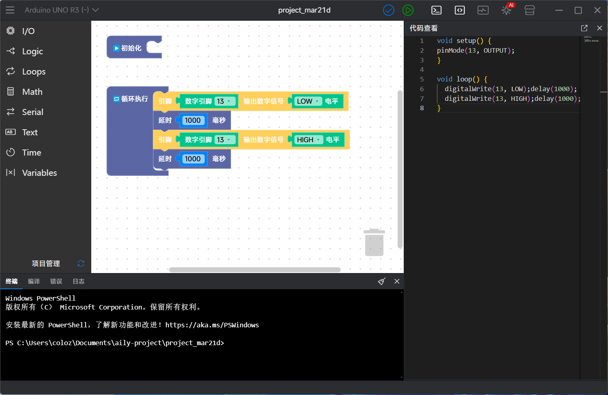

# AilyBlockly
灵感来自Github copilot  
## 关于本软件
aily Project是一个硬件开发集成环境，计划集成诸多AI能力，帮助硬件开发者更畅快的进行开发。  
aily Blockly是aily Project下的blockly IDE，前期面向非专业用户提供AI辅助编程能力，长远目标是打破专业开发和非专业开发的界限，最终实现自然语言编程。  



## 计划功能
· AI加持（项目模板生成、块/库生成、自动调试）  
· 工程化管理项目  
· 多版本开发板、库共存管理  
· 硬件仿真  

## 相关仓库
[开发板](https://github.com/ailyProject/aily-blockly-boards)  
[block库](https://github.com/ailyProject/aily-blockly-libraries)  
[编译器](https://github.com/ailyProject/aily-blockly-compilers)  
[相关工具](https://github.com/ailyProject/aily-project-tools)  

## 开发&&打包  

**库安装**
```
npm i
cd electron
npm i
```  

**electron运行**
```
npm run electron
```

**electron打包**
```
npm run build
```
打包需要开启windows的开发者模式
打包后生成的安装包在路径为dist\aily-blockly


## 项目赞助
本项目由以下企业和个人赞助

### 企业赞助  
<div>
<a target="_blank" href="https://www.seekfree.cn/" >
    
</a>
<a target="_blank" href="https://www.seeedstudio.com/" >
    
</a>
<a target="_blank" href="https://www.diandeng.tech/" >
    
</a>
<a target="_blank" href="https://www.openjumper.com/" >
    
</a>
<a target="_blank" href="https://www.titlab.cn/" >
    
</a>
<a target="_blank" href="https://www.emakefun.com" >
    
</a>
<a target="_blank" href="http://www.keyes-robot.com/" >
    
</a>
</div>

### 个人赞助   


## 项目使用到的主要开源项目
[electron]()本项目使用electron构建桌面程序  
[angular]()本项目使用angular作为渲染端构建主要UI逻辑  
[node]()本项目使用npm和node进行包管理和执行必要脚本  
[7z]()本项目使用7z减小部分包的大小（如巨大的ESP32编译器）  
[arduino-cli]()本项目使用arduino cli构建arduino项目  
其他内容可见[package.json](./package.json)  

