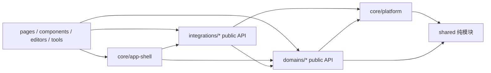

# Angular `services` 目录重构方案

状态：目录迁移、依赖收口和强制守卫已完成；超大 facade 拆分按独立业务改造继续

日期：2026-08-24

范围：`src/app/services` 及其 Angular 消费端

本文定义整理方案，并记录目录迁移、依赖边界收口和架构守卫的实际实施结果。本轮不改变外部业务契约；超大 facade 的内部职责拆分属于后续独立业务改造。

## 1. 结论

不建议一次性重写 `services`，也不建议只按文件名简单分文件夹。当前问题同时包含：

1. Angular DI 服务、纯函数、类型、策略、IPC 协议和业务编排混在同一目录；
2. 平台能力、工程域、编译烧录、子应用和 UI 编排没有依赖边界；
3. `ProjectService`、`AuthService`、`ConfigService` 等已经同时承担多类职责；
4. 高频服务被大量深层相对路径直接引用，使移动文件也会产生大面积 diff；
5. 当前缺少服务边界守卫和聚焦测试，不适合直接拆大类。

建议分五个阶段完成：

- P0：固化现状和依赖规则；
- P1：先归位纯模块和低风险服务，不改行为；
- P2：完成领域目录迁移，清空 `services` 根目录下散落的 TypeScript 文件；
- P3：保留旧 facade 契约，逐个拆分超大服务；
- P4：移除兼容出口，启用长期边界检查。

## 2. 实施前现状

### 2.1 规模

| 指标 | 实施前值 |
| --- | ---: |
| `src/app/services` 下 TypeScript 文件 | 102 |
| 直接堆在 `services` 根目录的文件 | 85 |
| Angular `@Injectable` 服务 | 55 |
| 非 DI 的类型、策略、协议、adapter 等 | 47 |
| 总行数 | 约 37,473 |
| `services` 下 `*.spec.ts` | 0 |
| 静态 import 图中的循环依赖组 | 1 |

已存在的循环依赖是：

```text
ProjectService -> UiService -> ChildToolProcessService -> ProjectService
```

这也是 `ProjectService` 和 `UiService` 需要通过 `Injector` 延迟取服务的原因之一。目录迁移不会自动解决该问题，必须在后续职责拆分中去掉反向调用。

### 2.2 超大文件

| 文件 | 行数 | 当前主要问题 |
| --- | ---: | --- |
| `project.service.ts` | 2,633 | 工程生命周期、ABI 数据、板卡、依赖、最近工程、UI 交互混合 |
| `auth.service.ts` | 2,325 | 会话、本地凭据、宿主快照、额度、OAuth、微信登录和登录 UI 状态混合 |
| `connection-graph.service.ts` | 2,262 | 连接图模型、pinmap catalog、扫描、校验、持久化和 iframe 通知混合 |
| `config.service.ts` | 1,876 | 用户配置、区域、资源源、板卡/库索引、缓存和使用频率混合 |
| `npm.service.ts` | 1,552 | npm 调用、板卡依赖、全局占用计数、工程依赖和进度 UI 混合 |
| `uploader-ble.service.ts` | 1,268 | 设备扫描、GATT 连接、OTA 协议、传输、重试和 UI 文案混合 |
| `child-tool-process.service.ts` | 1,255 | 进程会话、租约、恢复、日志、消息通道和安全校验混合 |
| `performance-tracer.ts` | 1,235 | 日志、指标、渲染预算、jank 和 dump 能力集中在单文件 |
| `blockly-library-package.service.ts` | 1,055 | 库包仓储、校验、重命名、路径解析和 package.json 变更混合 |
| `blockly-live-operation-bridge.service.ts` | 1,046 | 单个 bridge 直接编排 11 个内部服务 |
| `subapp-host-provider-dispatcher.ts` | 1,037 | 协议、invocation、artifact 传输、deadline 和 transport 混合 |

### 2.3 高扇出和高扇入

- `ProjectService` 直接依赖 17 个 `services` 内模块；
- `UiService` 直接依赖 13 个 `services` 内模块；
- `BlocklyLiveOperationBridgeService` 和 `CompileService` 各直接依赖 11 个内部模块；
- `ElectronService` 被 55 个 app 内 TypeScript 文件引用；
- `ProjectService`、`ConfigService`、`UiService` 分别被 44、37、35 个文件引用。

因此，上述高频服务必须最后移动，并在拆分期间保留稳定 facade，不能让消费端一次性改用多个内部服务。

### 2.4 需要先核实的低可达文件

以当前 Angular 静态 import 图为准，下列根目录文件没有发现有效消费者：

- `at-command.service.ts`
- `code-linter.service.ts`（仅有被注释的出口）
- `converter.service.ts`（图片上传使用的是功能内另一个同名服务）
- `esploader.service.ts`
- `subapp-host-provider-child-tool-transport.ts`

这些文件不能仅凭静态扫描立即删除。P0 需要再检查动态导入、`window` 注册、IPC 回调和打包入口，确认无运行时消费后单独清理。

## 3. 重构原则

1. **归属优先**：先判断能力由谁拥有，再决定文件位置；不按 `*-service`、`*-policy` 的名字机械分类。
2. **路径迁移与行为拆分分开**：同一个 PR 不同时大规模移文件、改对外 API 和改业务逻辑。
3. **稳定 facade**：对外广泛使用的服务在内部拆分时保留现有类名和主要 Observable/方法契约。
4. **纯代码不伪装成服务**：类型、策略、codec、protocol、adapter 归到所属领域的 `models/`、`policies/`、`protocol/` 或 `adapters/`。
5. **单向依赖**：底层平台和纯领域代码不反向 import 组件、页面或 app-shell 编排。
6. **保留跨进程契约**：Electron IPC、子应用进程租约、token-free auth snapshot、工程 ABI/历史数据兼容都是迁移边界，不因目录整理改变。
7. **不建全局 barrel**：不增加一个导出全部服务的 `services/index.ts`；每个领域只暴露自己的 `public-api.ts`。

## 4. 目标架构

### 4.1 依赖方向



约束：

- `shared` 不 import `core`、`domains`、`integrations` 和 UI；
- `core/platform` 不 import Angular 页面、组件、editor 和 tool；
- `domains` 不 import app-shell 组件，弹窗/通知由上层编排；
- `integrations` 通过领域 `public-api` 使用主软件能力，不深入领域内部文件；
- UI 只使用各领域对外 facade，不直接组装 repository、codec 或 IPC transport。

### 4.2 目标目录

```text
src/app/services/
├── core/
│   ├── auth/                 # 会话、登录流、宿主 auth 契约
│   ├── preferences/          # 配置、区域、主题、语言
│   ├── platform/             # Electron、OS、command、log、lock
│   └── app-shell/            # 主窗口 UI 编排、notice、workflow、update
├── domains/
│   ├── project/              # 工程生命周期、板卡、project-data
│   ├── dependencies/         # npm、板卡包、Blockly 库包
│   ├── build/                # 编译、验证、builder
│   ├── device/               # 串口、烧录、BLE OTA
│   └── schematic/            # 连接图、pinmap、AWS 转换
├── integrations/
│   ├── subapps/              # catalog、进程、租约、host provider
│   ├── automation/           # AI operation、MCP、UI automation
│   └── simulator/            # simulator iframe 和后台代理
└── shared/
    ├── models/
    └── utils/
```

`pages`、`components`、`editors`、`tools` 中仅被单一功能使用的服务继续与功能共置，不因为它是 `@Injectable` 就移入 `core`。

### 4.3 导入路径

建议在 `tsconfig.json` 增加有限别名，避免 `../../../services/...` 继续扩散：

```json
{
  "compilerOptions": {
    "paths": {
      "@core/*": ["src/app/services/core/*"],
      "@domain/*": ["src/app/services/domains/*"],
      "@integration/*": ["src/app/services/integrations/*"],
      "@shared/*": ["src/app/services/shared/*"]
    }
  }
}
```

外部消费者使用：

```ts
import { ProjectService } from '@domain/project/public-api';
```

领域内部使用相对路径，以便区分“公开契约”与“内部实现”。

## 5. 现有文件建议归属

| 目标领域 | 现有文件/目录 |
| --- | --- |
| `core/auth` | `auth.service.ts`、`auth-snapshot.ts`、`auth-quota-info.ts`、`shared-auth-record.ts`、`auth-session-invalidation.ts`、`auth-required-tool.ts`、`auth-required-tool-close.ts`、`detached-aily-chat-auth.ts`、`aily-chat-host-auth-runtime-bridge.ts`、`service-region-switch.ts` |
| `core/preferences` | `config.service.ts`、`settings.service.ts`、`theme.service.ts`、`translation.service.ts`、`tool-i18n.service.ts`、`development-mode-context.ts` |
| `core/platform` | `electron.service.ts`、`platform.service.ts`、`cmd.service.ts`、`cross-platform-cmd.service.ts`、`appdata-resource-lock.service.ts`、`log.service.ts`、`performance-tracer.ts` |
| `core/app-shell` | `ui.service.ts`、`notice.service.ts`、`action.service.ts`、`workflow.service.ts`、`onboarding.service.ts`、`iwindow.service.ts`、`update.service.ts` |
| `domains/project` | `project.service.ts`、`project-data/`、`project-debug-configuration.service.ts`、`coder-board-resolution.ts`、`coder-project-create-operation.ts`、`coder-project-template.ts` |
| `domains/dependencies` | `npm.service.ts`、`blockly-library-package.service.ts`、`local-library-sync.service.ts`、`library-submission.service.ts` |
| `domains/build` | `builder.service.ts`、`compile.service.ts`、`compile-validation.service.ts`、`probe-rs.service.ts`、`code-linter.service.ts` |
| `domains/device` | `serial.service.ts`、`serial-port-selection.ts`、`uploader.service.ts`、`uploader-ble.service.ts`、`upload-dispatch-policy.ts`、`upload-recovery-policy.ts`、`debugger-upload-policy.ts`、`esploader.service.ts`、`at-command.service.ts` |
| `domains/schematic` | `connection-graph.service.ts`、`connection-aws/` |
| `integrations/subapps` | `subapp-manager.service.ts`、`required-subapp.service.ts`、`child-tool-process.service.ts`、`child-tool-runtime-entry.ts`、`child-tool-close-lifecycle.ts`、`child-app-host-registry.service.ts`、`child-app-safety.service.ts`、`subapp-activity.service.ts`、`subapp-agent-bridge.service.ts`、`subapp-agent-presentation.ts`、`subapp-resource-lifecycle.service.ts`、`subapp-resource-lifecycle-adapter.ts`、`subapp-runtime-presentation-lease.ts`、`subapp-host-provider-dispatcher.ts`、`subapp-host-provider-child-tool-transport.ts`、`default-aily-chat-bootstrap.ts`、`aily-chat-tool-routing.ts` |
| `integrations/automation` | `ai-operation-registry.service.ts`、`ai-coder-diff-bridge.service.ts`、`ai-coder-diff-preview-store.service.ts`、`ai-coder-diff-channels.ts`、`ai-edit-summary.types.ts`、`blockly-live-operation-bridge.service.ts`、`mcp-bridge.service.ts`、`schematic-mcp-runtime.service.ts`、`ui-automation-registry.service.ts`、`main-ui-automation.service.ts`、`main-menu-automation-policy.ts` |
| `integrations/simulator` | `simulator-iframe-bridge.service.ts`、`background-agent.service.ts` |
| 待核实后归属或删除 | 根目录 `converter.service.ts`；与功能内同名服务的关系需单独确认 |

上表定义的是“业务归属”，不等于要把整个文件原样长期保留。例如 `auth.service.ts` 先移到 `core/auth`，再在 P3 内部拆分。

## 6. 超大服务拆分方案

拆分时保留现有对外类作为 facade，新增的内部类先不直接暴露给组件。

| 现有 facade | 建议内部拆分 | 首要边界 |
| --- | --- | --- |
| `ProjectService` | `ProjectLifecycleService`、`ProjectWorkspaceRepository`、`ProjectActivationService`、`RecentProjectStore`、`BoardConfigurationService`、`ProjectPackageService` | 保留 `.abi` 读写、旧数据迁移、保存/关闭顺序和板卡切换时序 |
| `AuthService` | `AuthSessionStore`、`AuthApiClient`、`AuthInitializationService`、`AuthQuotaProjection`、`OAuthFlowService`、`HostAuthSnapshotPublisher` | 凭据继续宿主持有，React 子应用仍只获取 token-free snapshot，bridge 失败时 fail-closed |
| `ConfigService` | `ConfigStore`、`RegionRuntimeService`、`ResourceSourceResolver`、`BoardCatalogService`、`LibraryCatalogService`、`BoardUsageStore` | 区域切换与登录失效顺序不变，本地配置兼容不变 |
| `ConnectionGraphService` | `ConnectionGraphRepository`、`ConnectionGraphValidator`、`PinmapCatalogRepository`、`PinmapScanner`、`ConnectionGraphPromptBuilder`、`ConnectionGraphPresentationPort` | 数据模型和磁盘格式先稳定，iframe 通知不进 repository |
| `NpmService` | `PackageClient`、`BoardDependencyManager`、`ProjectDependencyManager`、`GlobalDependencyUsageStore`、`DependencyInstallProgress` | 安装/卸载命令和资源锁时序不变 |
| `UploaderBleService` | `BleDeviceRegistry`、`BleConnection`、`BleOtaProtocol`、`BleFirmwareTransport`、`BleUploadCoordinator` | Web Bluetooth/Electron 选择契约、ACK 超时和取消语义不变 |
| `ChildToolProcessService` | `ChildToolSessionRegistry`、`ChildToolProcessGateway`、`ChildToolLeaseManager`、`ChildToolRecoveryPolicy`、`ChildToolMessageTransport` | acquire/release 引用计数、共享进程领养、恢复和安全 URL 校验不变 |
| `BlocklyLibraryPackageService` | `BlocklyLibraryRepository`、`BlocklyLibraryValidator`、`BlocklyLibraryRenameOperation`、`BlocklyLibraryPathResolver` | package 完整性校验和重命名的原子性不变 |
| `BlocklyLiveOperationBridgeService` | 按 operation 分 handler，由 `LiveOperationRegistry` 注册 | bridge 只做校验、路由、取消和进度投影，不直接实现各领域业务 |
| `SubappHostProviderDispatcher` | `HostProviderProtocol`、`InvocationRegistry`、`ArtifactTransferRegistry`、`ProviderDeadlinePolicy` | transport version、有界 payload、取消和超时契约不变 |
| `performance-tracer.ts` | `PerformanceTraceStore`、`EventLoopSampler`、`RendererBudgetEvaluator`、`PerformanceDumpFormatter` | 采样开关和生产环境性能开销不变 |

## 7. 实施分期

### P0：基线与守卫

产出：

1. 生成可重复的 service inventory，记录文件、行数、对内/对外依赖、`providedIn` 和公开导出；
2. 新增边界检查脚本，先以报告模式运行，不立即阻塞开发；
3. 记录当前唯一循环依赖，阻止新增循环；
4. 对 5 个无静态消费文件做运行时可达性核实；
5. 建立最小验证矩阵，不在同一 PR 引入新测试框架和开始迁移。

基线命令：

```bash
npm run guard:aily-chat-mainline
npx tsc -p tsconfig.app.json --noEmit
npx ng build --configuration development
npm run test:e2e:fast
git diff --check
```

`test:e2e:fast` 是真实运行态验证，需要在迁移前确认当前环境的执行条件；纯文件移动 PR 至少必须通过 TypeScript、development build 和守卫脚本。

### P1：纯模块和低风险文件归位

1. 先迁移 47 个非 DI 模块，放入所属领域的 `models`、`policies`、`operations`、`protocol` 和 `adapters`；
2. 再移动低扇入、低扇出的小服务；
3. 仅更新 import 和 `public-api`，不改类名、方法、DI scope 和生命周期；
4. 一个 PR 只处理一个目标领域，便于 review 和回退。

### P2：领域服务迁移

建议顺序：

1. `domains/device`、`domains/schematic`；
2. `domains/build`、`domains/dependencies`；
3. `integrations/simulator`、`integrations/automation`；
4. `integrations/subapps`；
5. `core/preferences`、`core/auth`、`core/app-shell`；
6. `core/platform` 和 `domains/project` 的高扇入 facade 最后迁移。

如果单次无法修改所有消费端，可在旧路径放置临时 re-export shim，但必须同时满足：

- 标记 `@deprecated` 和目标路径；
- 不允许新代码 import shim；
- 边界检查中记录 shim 数量且只能递减；
- 最晚在 P4 删除，不作为长期兼容层。

### P3：逐个拆分大服务

每次只拆一个 facade，顺序建议为：

1. 纯逻辑占比高、外部契约较少的 `performance-tracer`、`connection-graph`；
2. `blockly-library-package`、`npm`、`uploader-ble`；
3. `child-tool-process`、`subapp-host-provider-dispatcher`；
4. `config`、`auth`；
5. `project`、`ui`、`blockly-live-operation-bridge` 最后处理，并在这一阶段消除循环依赖。

拆分 PR 必须有对应的特征测试或契约测试。当前工程没有 Angular unit-test builder，此问题需要在第一个 P3 PR 之前单独决策；不应该靠“能编译”代替行为保护。

### P4：收尾与强制约束

1. 删除 `src/app/services` 根目录下的所有 shim，保留 `services` 总目录及其领域子目录；
2. 边界检查从报告模式切换为 CI 阻塞；
3. 禁止新增跨领域深层 import、循环依赖和全局 barrel；
4. 对新增超大文件做评审门禁：超过 800 行需要说明职责边界，超过 1,200 行默认不接受继续扩张。

## 8. PR 切分建议

| PR | 内容 | 是否允许改行为 |
| --- | --- | --- |
| PR-0 | inventory、依赖图、边界报告脚本 | 否 |
| PR-1 | 别名与纯模块分类 | 否 |
| PR-2 | device + schematic | 否 |
| PR-3 | build + dependencies | 否 |
| PR-4 | simulator + automation | 否 |
| PR-5 | subapps | 否 |
| PR-6 | auth + preferences + app-shell | 否 |
| PR-7 | platform + project，清空 `services` 根目录散落文件 | 否 |
| PR-8 起 | 每个 PR 拆一个超大 facade | 是，但要有契约保护 |
| 收尾 PR | 删 shim、CI 强制边界、更新开发文档 | 否 |

如果中间某个 PR 的 import diff 过大，应按目标子目录再分，不应通过把逻辑改动一起塞进来“减少 PR 数”。

## 9. 验收标准

### 目录与依赖

- `src/app/services` 仅保留 `core`、`domains`、`integrations`、`shared` 等有归属的子目录，根目录不再堆放 TypeScript 文件；
- 55 个 Angular 服务都有明确归属，纯函数/类型放入所属领域的子目录，不再堆在 `services` 根目录；
- 不存在 `ProjectService -> UiService -> ChildToolProcessService` 循环；
- UI 消费者不深层 import repository、policy、protocol 或 transport；
- 不存在全局 service barrel，跨领域只通过 `public-api`。

### 行为兼容

- Angular development build 与 TypeScript 检查通过；
- 主窗口启动、配置加载、主题/语言、登录/退出正常；
- Blockly 工程新建、打开、保存、关闭、板卡切换与 `.abi` 兼容正常；
- 编译、串口烧录、BLE OTA 的进度、取消和错误语义不变；
- 子应用 catalog、acquire/release、重启、共享进程和 UI surface 正常；
- Aily Chat 的宿主认证仍是 token-free snapshot，不向 React 或子进程暴露凭据；
- Electron IPC channel、payload 和 timeout 不因 TypeScript 路径调整改变。

### 验证边界

源码编译和 Angular build 只能证明静态路径和打包成立。认证、工程数据、子进程租约、串口/BLE 和跨窗口行为仍需要 Electron 运行态验收；Windows、真实硬件和打包安装不能由 macOS development build 替代。

## 10. 后续决策

1. 已确认保留 `src/app/services`，并在其下使用 `core + domains + integrations + shared` 目录结构；
2. 目录迁移、旧路径移除、跨域公开入口、port/adapter 解耦和零豁免守卫均已完成；
3. 超大 facade 拆分前，采用什么聚焦测试方案，以及哪些跨进程场景必须保留 Playwright/Electron 验收；
4. 首个业务拆分对象默认从 `performance-tracer` 或 `connection-graph` 中选择，不直接从 `auth`、`project` 等高风险 facade 开始。

## 11. 目录与依赖边界实施记录

2026-08-24 已完成：

- 保留 `src/app/services` 作为服务总边界，根目录 85 个散落 TypeScript 文件已全部归入 `core`、`domains`、`integrations` 的明确子域；
- 102 个原有文件全部完成唯一映射，不保留旧路径 shim；
- 建立 12 个领域 `public-api.ts`，页面、组件、editor 和 tool 不再直接使用原 `services/*` 深层相对路径；
- `tsconfig.json` 已增加 `@core`、`@domain`、`@integration`、`@shared` 别名，实际目标均位于 `src/app/services` 下；
- 新增 `scripts/check-angular-service-architecture.mjs`、架构基线和可重复 inventory；
- 初始基线记录 123 条已存架构债务和 1 个循环依赖组；当前基线已清空为 0 条豁免、0 个循环，守卫会直接阻止新增跨域深层引用、UI 反向依赖或循环；
- 5 个原无静态消费候选文件已归位，但不经 `public-api` 暴露；其中 `esploader.service.ts` 与当前依赖类型存在历史不兼容，本次不改其业务代码。

后续边界优化：

- 已将服务内部 36 条 `@core/platform/*`、9 条 `@core/preferences/*` 和 6 条 `@core/auth/*` 深层引用统一收口到各领域的 `public-api`；
- 将通知纯数据契约下沉到 `services/shared`，解除 `ConnectionGraphService` 对 app-shell 类型的反向依赖；
- 为 device policies 建立窄 `public-api`，避免 subapps 为一个纯策略加载整个 device barrel；
- 为 Mermaid 展示、Blockly 生成代码、Blockly live editor、build action、项目应用协作、构建/依赖工作流、上传 UI、自动化 UI 和子应用自动化建立 port，由应用层 adapter 或现有 app-shell service 在 `app.config.ts` 组合；
- `ProjectService` 不再直接依赖 `UiService`、`ActionService`、`NpmService`、Blockly editor 或 AI operation registry；调用由 `ProjectApplicationPort` 延迟解析，保留原有 facade 契约；
- build、dependencies、device 不再反向依赖 app-shell 或 editor；automation 与 subapps 之间通过双方拥有的窄 port 解耦；
- 初始 `cross-domain-deep-import`、`domain-ui-import`、`integration-ui-import` 共 123 条现已全部清零；当前服务架构清单为 113 个模块，静态 import 图为 0 个循环依赖组；
- 根领域 `public-api` 仅在依赖方向安全时使用；可能形成 barrel 环的双向协作改用 port/adapter，而不是用路径替换掩盖循环。

已通过：

```bash
npm run architecture:services
npm run guard:aily-chat-mainline
npx tsc -p tsconfig.app.json --noEmit
npx ng build --configuration development
npm run test:e2e:fast -- e2e/tests/smoke.spec.ts
```

Electron smoke 结果为 5/5 通过，覆盖生产 Angular build、主窗口加载、头部/底部布局、preload 版本桥和渲染进程存活。Windows、真实串口/BLE 硬件和完整业务回归未在本次执行。
