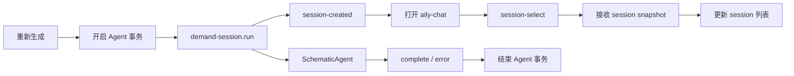
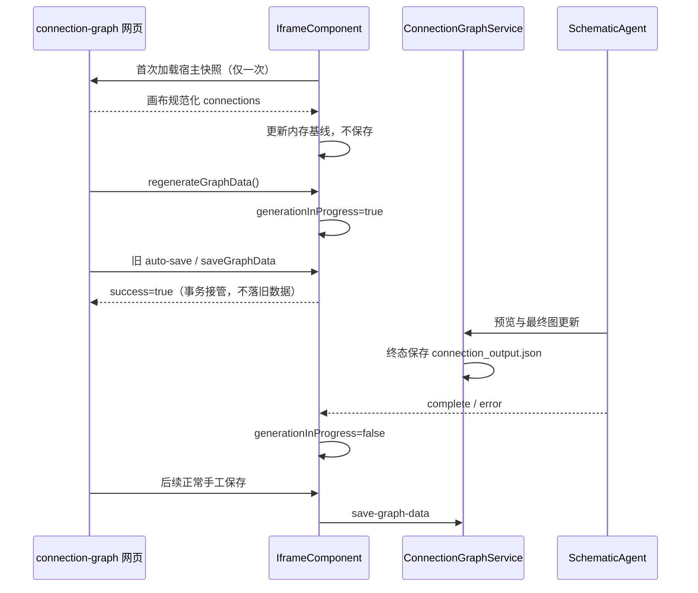

# 电路连接窗口重新生成修复执行细节

## IDEA

### Intent：最终目标

用最小修改打通“重新生成 → 创建 session → 打开 aily-chat → session 列表同步 → Agent 完成 → 恢复保存”的完整链路。

### Data：可用证据

- `IframeComponent.onRegenerate()` 是网页重新生成按钮的宿主入口。
- `BackgroundAgentService.requestSchematicGeneration()` 能接收 `session-created` 事件，并通过 `UiService.openAilyChatSession()` 导航。
- 修复前 `BackgroundAgentService` 使用 `hasConnectionGraph(cwd)` 否决已有图场景的 `revealSession`。
- aily-chat 的 `openAgentSession()` 接收 session snapshot，`acceptSnapshot()` 会执行 `ensureActiveSessionSummary()`。
- iframe 保存请求以 `messageId` 等待主窗口回复，5 秒超时即返回失败；重新生成点击前可能已有保存仍在等待。
- 首次打开原先同时从 `initedGraph()` 和连接完成分支推送数据，造成同一宿主快照被渲染两次。
- 画布在加载时会规范化 vertices，并通过 150ms debounce 的 `onConnectionsChanged` 回调宿主；该回调是渲染回声，不是用户编辑。

### Edges：边界与限制

- 不修改 aily-chat session store，因为现有 session 选择链路已经负责列表同步。
- 不修改线上 connection-graph 网页代码，通过宿主的生成事务边界消除跨版本保存竞态。
- 不改变主进程 `ConnectionGraphService` 的最终保存实现。
- 初始化阶段不使用固定时间窗口，不影响初始化结束后的手工编辑保存。
- 未新增测试用例，未调用浏览器做 UI 验证。

### Answer：交付格式与成功标准

代码修改集中在两个文件：

1. `background-agent.service.ts`：协议对齐并尊重 `revealSession`。
2. `iframe.component.ts`：重新生成展示 session，并维护 Agent 生成期间的保存所有权。

成功标准是 TypeScript 编译通过，重新生成请求可被当前 aily-chat 解析，代码格式和 diff 检查无误。

## 代码修改

### `background-agent.service.ts`

- channel：`aily-chat-host-service-v1` → `aily-chat-demand-session-v1`
- action：`schematic.generate` → `demand-session.run`
- 新增 `kind: schematic`、session title、`mode: agent`、`resources: []`
- prompt marker：`@SchematicAgent` → `[AGENT: SchematicAgent]`
- `revealSession` 直接采用调用方的显式布尔值，不再绑定 `hasConnectionGraph()`

### `iframe.component.ts`

- 首次生成与重新生成均使用规范 prompt marker。
- 重新生成传入 `revealSession: true`。
- 新增 `schematicGenerationInProgress`，从请求发出持续到后台 `complete` / `error`。
- 进入生成事务时结清点击前仍在等待的旧 iframe 保存。
- 生成事务中新的 iframe 保存直接确认由事务接管，不发送旧快照到主进程。
- 嵌入模式用 `generateSchematic().finally()` 结束事务；独立窗口通过 `generate-graph-progress` 终态结束事务。
- 删除 `initedGraph()` 的重复数据推送，只保留 Penpal 连接完成后的单一初始化入口。
- 初始化期间不执行 iframe 持久化；推送完成后读取画布规范化 connections，作为真实用户编辑前的比较基线。

## 关系图

## 保存数据流

## 验证项目

1. 运行 `npx tsc -p tsconfig.app.json --noEmit`。
2. 使用当前 aily-chat 的实际请求解析器校验完整重新生成请求。
3. 运行 `git diff --check`。
4. 检查两份中文文档的 Markdown 格式。
5. UI 手动验证交给用户：关注自动打开 aily-chat、目标 session、session 列表和“保存失败”提示。

## 自我批判

1. 没有在 aily-chat UI 中额外强制刷新 session 列表，因为 `acceptSnapshot()` 已有确定的摘要同步；重复刷新会增加竞态和请求量。
2. 没有延长保存超时，因为问题发生在重新生成的保存所有权切换，而不是已证实的磁盘慢写；延长超时只能降低概率。
3. 没有把保存屏蔽扩展到普通预览和手工编辑，避免用全局兜底掩盖真实保存错误。
4. 初始化采用“单次推送 + 画布实际数据基线”，没有依赖 150ms/1000ms 等网页内部定时参数，避免未来页面调整节流时间后再次失效。
