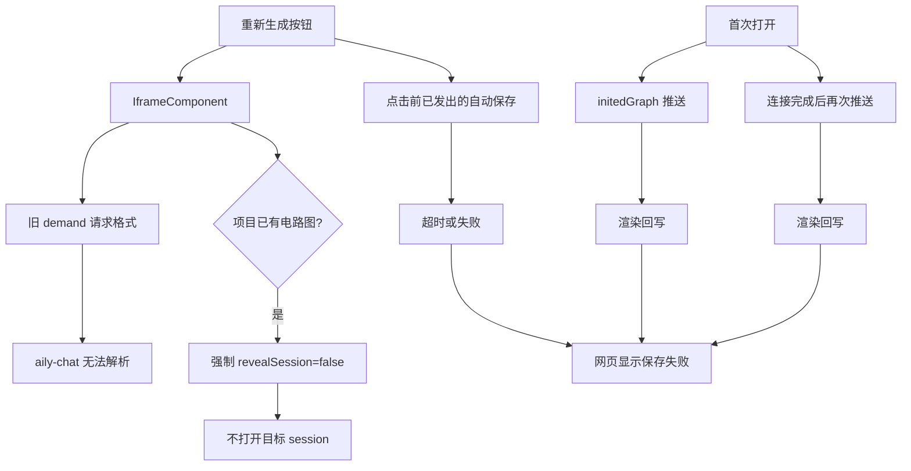
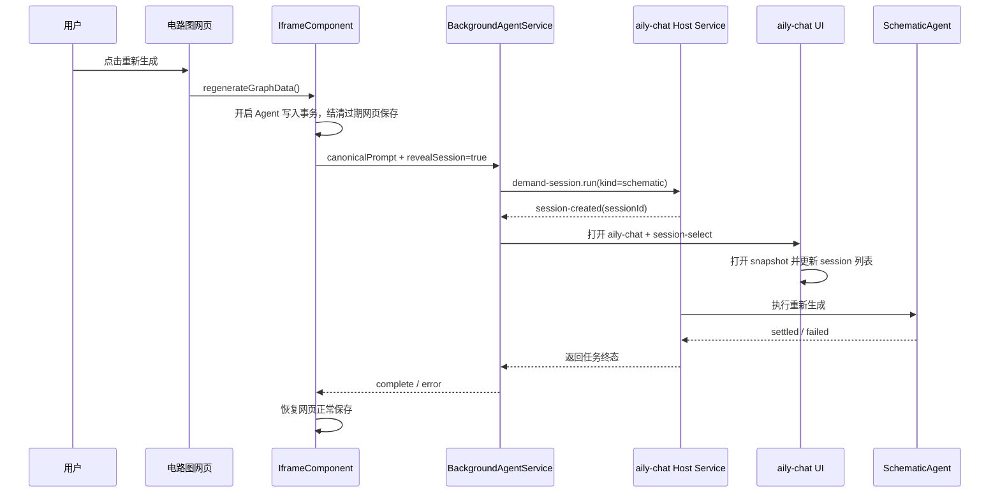

# 电路连接窗口重新生成失效修复

## IDEA

### Intent：最终目标

用户在已有电路连接图的窗口中点击“重新生成”后，应创建新的 `SchematicAgent` 会话、主动打开 aily-chat 并进入该会话，同时不再因生成切换阶段的过期自动保存显示“保存失败”。

### Data：可用证据

1. 电路图网页的“重新生成”按钮调用宿主暴露的 `regenerateGraphData()`。
2. Aily Blockly 原先使用旧协议 `aily-chat-host-service-v1` + `schematic.generate`，当前 aily-chat 只接受 `aily-chat-demand-session-v1` + `demand-session.run`。
3. `BackgroundAgentService` 原先将 `revealSession` 与“项目中不存在电路图”绑定，导致重新生成即使要求展示会话，也会被强制改成 `false`。
4. aily-chat 收到 `session-select` 后会打开指定 session；session snapshot 被接收时会调用 `ensureActiveSessionSummary()`，因此该会话会进入当前 session 列表。
5. 网页端点击重新生成时只会清除尚未触发的自动保存定时器，无法取消已经发出的保存请求；宿主保存请求等待 5 秒未完成会返回 `success: false`，网页端据此显示“保存失败”。
6. SchematicAgent 的预览更新显式携带 `autoSave: false`，最终产物由主进程领域服务提交，不依赖 iframe 网页端的保存请求。
7. 首次打开时，同一份宿主快照原先会经 `initedGraph()` 和 Penpal 连接完成后的主动分支推送两次；画布渲染会规范化连线并产生延迟的 `onConnectionsChanged`，从而把“加载快照”误判成两次保存。

### Edges：边界与限制

1. 只修改电路图生成协议、会话展示意图和 Agent 生成期间的 iframe 保存边界。
2. 重新生成会主动打开 aily-chat 并选中新创建的 session；首次无图生成保持相同行为。
3. Agent 生成期间，网页端新发出的保存请求以及点击前尚未结束的旧请求会被视为已由新生成事务接管，不再写入旧快照。
4. 不改动 SchematicAgent 最终保存、Workspace History、手工编辑的正常保存链路。
5. 不删除已有电路图；新图在 Agent 终态提交前，原图仍是项目中的有效版本。
6. 首次打开只允许宿主向 iframe 单向加载一次快照；渲染规范化结果只更新内存基线，不进入持久化。
7. 按仓库约束不新增测试用例，不调用浏览器做 UI 验证。

### Answer：交付格式与成功标准

交付包括：

1. 首次生成与重新生成统一发送当前 demand-session 协议。
2. 重新生成显式发送 `revealSession: true`，宿主不再根据“是否已有图”篡改该意图。
3. Agent 运行期间由宿主屏蔽 iframe 的过期保存，并在任务完成或失败后恢复正常保存。
4. 首次打开的初始化数据只推送一次，并以画布规范化后的连线建立编辑基线。
5. TypeScript 静态检查、协议解析检查与 diff 检查通过。

成功标准：点击“重新生成”后，aily-chat 自动打开并进入新 session，session 列表包含该 session，生成流程完成且不出现由过期自动保存导致的“保存失败”。

## 根因架构图

## 修复后数据流图

## 实施决策

### 会话展示

`revealSession` 是调用方的明确 UI 意图，不应由数据层根据“是否已有电路图”重新推断。首次生成和重新生成都显式传入 `true`，后台在创建 session 后调用现有 `openAilyChatSession(sessionId)`，复用 aily-chat 已有的 session 选择和列表同步链路。

### 保存所有权

重新生成开始到任务终态之间，电路图的正式写入所有者是 SchematicAgent。网页端此时产生的保存属于旧视图自动保存竞争，不应覆盖 Agent 预览或触发错误通知。因此宿主只在该时间窗内将 iframe 保存确认成“请求已被接管”，并不拦截主进程领域服务提交最终图。

### 初始化所有权

首次打开属于宿主快照加载，不属于编辑事务。宿主在 Penpal 连接完成后只推送一次数据，并读取画布规范化后的 connections 作为后续比较基线；初始化过程中产生的保存和变更回调均不进入主进程保存链路。

## 自我批判

1. 仅把 `revealSession` 改成 `true` 能解决导航，却不能解决旧保存竞态；两者是独立根因，必须分别处理。
2. 全局关闭保存会破坏用户手工编辑，因此保存屏蔽严格限定在 SchematicAgent 运行时间窗内。
3. 对过期 iframe 保存返回 `success: true` 的含义是“该请求已被新的 Agent 事务接管并安全忽略”，不是宣称旧快照已经落盘；这是现有 `{ success: boolean }` 协议下避免错误提示且不让旧数据覆盖新数据的最小表达。
4. 初始化不能使用固定延迟来猜测渲染完成时间；记录画布实际规范化结果作为基线，才不会吞掉之后真实的用户编辑。
5. 静态检查无法代替真实窗口、session 导航和长耗时生成验收，本次 UI 结果由用户手动验证。
