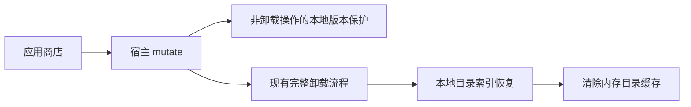
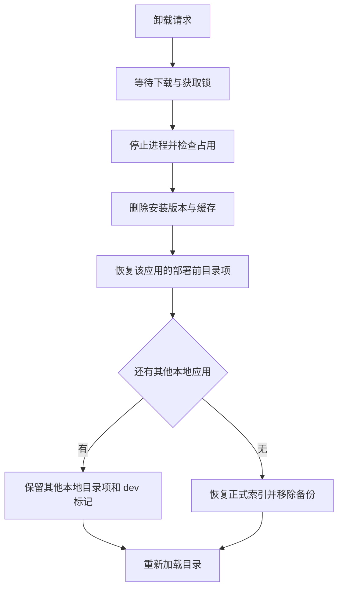

# 本地子应用卸载修复

## Intent：最终目标

应用商店允许卸载 deploy:next 部署的本地子应用，卸载后可安装正式版。

## Data：可用证据

- `electron/subapp-manager.js` 的 mutate 在获取锁前、获取锁后均禁止修改本地版本，误将卸载包含其中。
- deploy:next 在版本存储写入 next 收据，同时将 subapp-index.json 标记为 dev，并备份部署前索引。
- 现有卸载流程已经处理进程停止、占用检查、版本目录、旧 npm 入口、下载缓存和依赖记录。
- 仅放开卸载仍会留下本地索引与内存缓存，影响正式版安装。

## Edges：边界与限制

- 修改宿主 aily-blockly，不改 aily-lex-pro 部署脚本。
- 本地版本继续禁止在线安装、重装和更新覆盖；显式卸载允许执行。
- 沿用完整卸载语义：删除该应用所有安装版本；不跟随符号链接删除源码或构建产物。
- 保留其他本地应用的目录项与 dev 保护。
- 不修改本机实际安装，不新增测试用例，不运行浏览器验证。

## Answer：交付格式与成功标准

交付宿主最小代码修复、现有验证结果和自我审查记录。成功标准为卸载可进入既有清理流程，成功后没有该应用的本地索引覆盖，后续正式版目录可重新加载。

## 执行计划

1. 将两处本地保护限定为非卸载操作。
2. 清理卸载应用的本地索引覆盖；最后一个本地应用卸载后恢复正式索引并移除备份。
3. 清空内存索引，在后续列表读取时重新加载。
4. 运行语法检查及已有子应用版本管理测试，审查删除边界。

## 架构图

## 数据流图

## 执行细节与自我审查

### 实施结果

- 两处本地版本保护均只限制非卸载操作，避免获取锁前后行为不一致。
- 完整清理后、结束卸载事务前恢复本地索引；恢复失败仍保留卸载事务，允许重试。
- 使用现有原子 JSON 写入工具恢复索引；剩余本地应用通过现有解析器识别。
- 卸载成功后清空内存索引，后续列表重新读取正式缓存；无备份时移除本地索引并重新获取远端目录。
- 修改范围为一个宿主代码文件及本文档，没有改动本机安装数据。

### 验证

- Node.js 语法检查通过。
- git diff --check 通过。
- 已有 subapp-manager-versions 与 subapp-version-store 共 31 项检查，30 项通过；1 项因缺少 child/aily-coder-editor.json 打包资源而失败，未进入本次修改路径。
- 最终调整复用原子写入工具后，定向复跑已有卸载、本地版本和 portable 安装相关检查，11 项全部通过。
- 未新增测试用例，未运行浏览器 UI 验证；既有用例覆盖本地版本识别和常规卸载，但不直接覆盖本地 next 卸载后重装的完整组合。

### 自我审查

- 根因不止卸载拦截，还包含卸载后本地目录覆盖残留；两部分均已处理。
- 卸载沿用现有进程占用检查和目录删除方式，清理链接入口不会递归删除链接指向的源码或构建目录。
- 其他本地应用仍存在时保留 dev 索引保护；原有全局安装保护策略不在本次范围内。
- 没有备份且网络不可用时无法获取正式目录，需网络恢复后刷新应用商店。
- 本次未打包或替换已安装的宿主；需重启运行修改代码的开发宿主，或重新构建宿主后验收。
