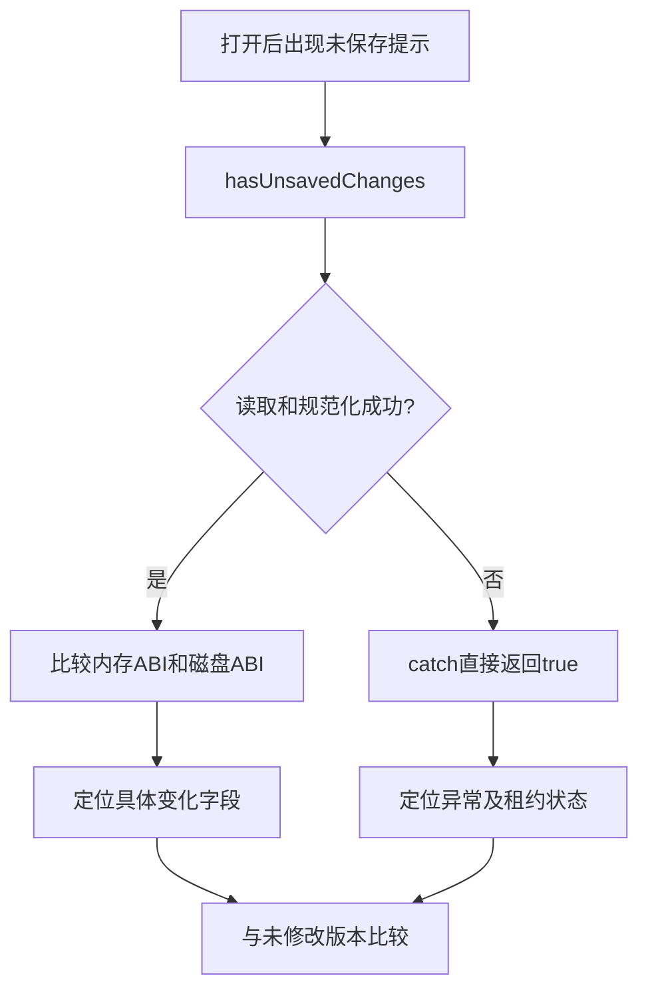

# 打开工程未保存提示诊断

## Intent

用户报告采集优化后所有工程打开即出现未保存提示。按回归问题调查，确认具体内存差异或检查异常，不通过强制清除脏状态掩盖问题。

## Data

- 当前未提交业务修改仍仅涉及 ABS 采集与检查策略；虚拟画布文件已撤销。
- `_ProjectService.hasUnsavedChanges` 比较规范化的内存 ABI 与磁盘 ABI，不读取 projectRevision 计数。因此不能把原因直接解释为额外快照导致 revision 增加。
- 此函数 catch 中返回 true：编辑租约阻止读取、文件读取或项目资源解析失败，都可能显示为未保存，而非真实内容差异。
- 比较通过 getProjectAbiForSave -> getProjectDocument -> getWorkspaceJson 读取实时工作区；getWorkspaceJson 会调用自定义函数的 prepareSerialization。
- 完整项目比较包含视口状态。加载后的坐标/视口调整与字段序列化补全可能产生差异，但尚未取得该次现场 diff，不能指定其中任何一个为根因。
- 优化入口只有 exportGeneration 与 inspectGeneration 的特定采集路径，普通项目加载并不直接调用该新 helper。若 Aily Chat 同时触发 ABS 请求，需要结合实际请求时序判断。
- 本地应用日志末尾记录主应用于 2026-09-21 14:04:51 退出；进程清单未发现交互式 Aily Blockly 主进程，只发现另一个独立 eval Electron。没有操作或关闭该 eval 实例。
- 最近日志可识别的工程包含 issue-694-8209-blocks 与 project_xzEsp32S3_327359。现有日志未发现“检查未保存更改时出错”记录，但不能据此排除未持久化的 renderer 异常。

## Edges

当前缺少触发提示时的活跃工作区。已请求用户启动平时使用的主应用并打开任意问题工程，暂不保存，以便读取差异。没有修改未保存判断逻辑，没有覆盖工程 ABI，没有新增测试用例或进行 UI 操作。

## Answer

待交付：准确的差异字段或异常原因、是否由本次补丁引入的证据，以及必要的最小修复。当前尚未确认根因；本文件记录调查进度，不是已完成的诊断结论。

## 现场取证结果

用户重新打开工程后，通过现有 CLI bridge 的 project_abi_check 读取到 PID 27912、工程 project_xzEsp32S3_505112，changed=true 且请求成功。因此现场是实际比较差异，不是 catch 误报。

临时扩展只读摘要返回，使其附带规范化内存/磁盘数据；未调用保存。开发服务刷新后取得差异，随后移除了临时扩展，project.service.ts 与 HEAD 无差异。

### 精确差异

| 位置 | 内存 | 规范化磁盘 |
| --- | --- | --- |
| /$ailyProjectData | mode=external-only, schemaVersion=1 | 缺失 |
| 第一个 controls_ifelse 的 extraState | hasElse=true | 缺失 |
| 第二个 controls_ifelse 的 extraState | hasElse=true | 缺失 |

离线比较中仅移除这三处差异后，两个完整对象完全相等，没有发现其他字段差异。

磁盘原文件是顶层 blocks/variables/$ailyProjectData 的工作区格式。normalizeProjectDocument 的兼容分支删除 page.content 上的标记，却没有将它保留在返回的完整项目根上；内存 getProjectAbiForSave 又加入该标记，所以两边不一致。这一差异本身足以让此类格式工程一直被判未保存。

两个 controls_ifelse 块来自 lib-core-logic 的声明：声明本身有 ELSE 输入，并使用 controls_if_mutator。加载后的实际工作区序列化补出了 hasElse=true，磁盘没有此字段。即使修复项目标记比较，这两个序列化补全差异也仍会导致提示。

### 与 ABS 修改的对照

临时将四个修改过的 ABS 既有文件恢复到 HEAD，保留诊断通道，以同一工程重新查询。rendererGeneration 从 1 增至 3，确认经历刷新。未修改 ABS 的版本仍 changed=true，且 memoryHash 和 diskHash 均与修改版逐字相同。

随后恢复 ABS 修复补丁，撤去临时诊断通道。没有更改、保存或覆盖 project.abi。上述对照证明当前工程的三处差异不由本次未提交 ABS 采集补丁引入；不能据此断言用户历史版本从未存在其他变化。

## 最终 Answer

根因是旧工作区格式到当前完整项目格式的比较不对称，以及加载后补全的块状态直接与原始磁盘状态比较。当前不是 revision 计数增加，也不是检查抛错。本轮完成定位和版本对照，尚未修改未保存判断逻辑。

修复方向：先保留兼容规范化分支中的项目标记；再为加载补全建立可靠的比较基线，避免把系统规范化当作用户编辑，同时继续检测真实 extraState 修改。不要全局忽略 extraState，也不要把当前内容自动写入磁盘来消除提示。
