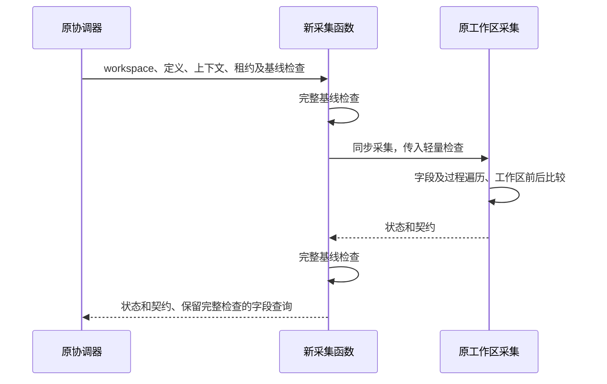

# 投影采集优化实施记录

## Intent：最终目标

以最小可合并改动解决投影捕获中的重复全量项目快照。

## Data：实现与验证

- 新增 `src/app/integrations/blockly/abs/abs-projection-capture.ts`，封装同步采集边界。
- 原协调器仅新增一个导入，替换导出及草稿检查的两处调用。
- 循环内保留上下文、定义及编辑租约检查；完整 revision 检查在采集前后执行。
- 保留原捕获函数的工作区前后序列化比较。
- 返回的 fieldDefinition 查询仍执行完整 revision 检查，避免异步消费者持有过期契约。
- 现有 abs-workspace-sync.service.spec.ts 与 abs-runtime-contracts.spec.ts 共 171 项全部通过，测试执行约 22.6 秒。
- `tsc --noEmit -p tsconfig.app.json` 通过。
- 未新增测试文件，未操作用户 Electron 窗口。

## Edges：边界与自我审查

仅消除本次同步采集循环中的全量项目检查，不代表全链路已经线性化。外层其他完整快照、原生验证、DOM 渲染仍有成本。没有进行本轮 8209 块压测，没有实际提速倍数，也没有确认修复远端 409。

检查时机从逐字段转为阶段边界，正常只读 getter 的输出契约不变，持久状态变化仍会被前后检查拒绝。但有副作用 getter 在同一阶段修改后恢复状态的行为不能承诺与原逐字段检查完全等价；这仍是明确的边界，不将回归通过表述为所有自定义扩展行为的证明。

## Answer：交付与合并

业务代码共两个文件：一个新文件和一个既有文件的三处行级改动。未增加依赖、缓存、Worker 或虚拟化框架。原项目加载、应用、回滚和发布代码未改动。

执行计划与本记录采用 IDEA 框架；后续 Worker 和虚拟渲染应独立实施与验证，避免扩大本补丁的合并范围。
