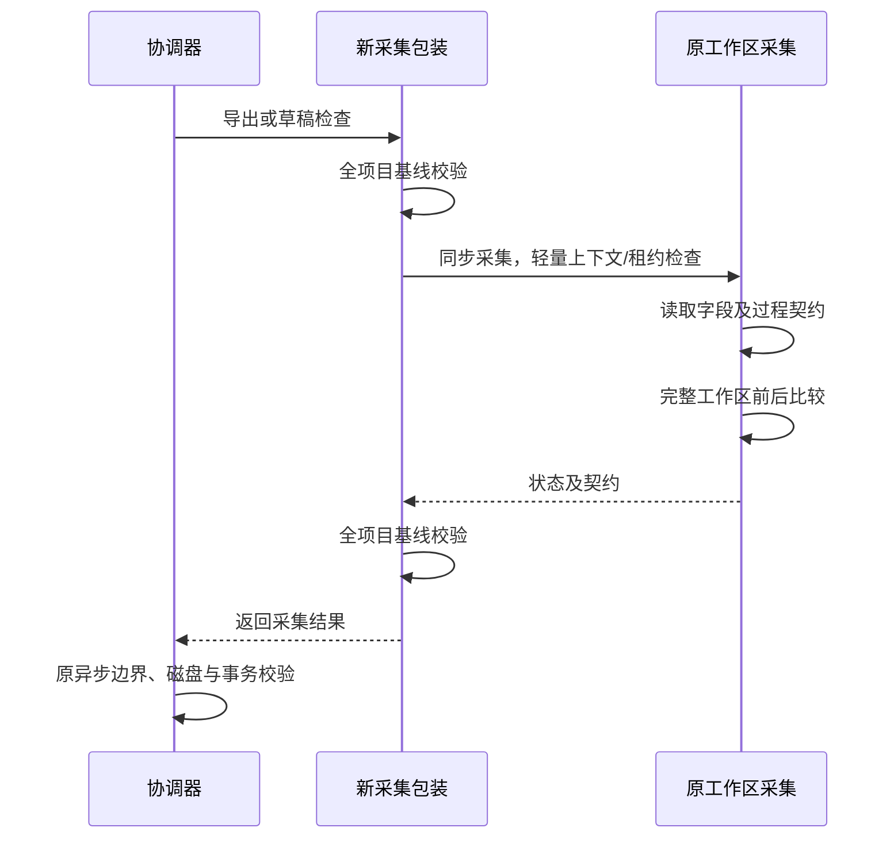

# 投影采集优化审查结果

> 后续状态：跨 getter 中间状态检查已修复，详见《投影采集检查修复记录.md》。以下保留修复前审查证据。

## Intent：审查结论

撤销虚拟画布实现，审查 ABS 采集优化两个业务文件。未发现标准 Blockly 正常读取路径的确定功能回归；发现一项有明确触发机制的自定义 getter 兼容性风险，不能将本补丁描述为完全等价优化。

## Data：撤销和审查范围

已将主画布组件、多选插件和 SVG 导出器精确恢复到 HEAD，删除两个新增 viewport 文件及本轮虚拟画布执行/实施文档。撤销前已逐一核对 diff，相关文件只有本任务引入的改动。保留此前研究文档及 ABS 优化。

保留的业务代码：

- `src/app/integrations/blockly/abs/abs-projection-capture.ts`
- `src/app/integrations/blockly/abs/abs-workspace-sync.service.ts`：一个 import、两处调用替换。

### 条件性风险：自定义 getter 中间状态可能被采入契约

优先级 P2，位置 `abs-projection-capture.ts:18–21`。

原实现每个字段及普通块采集后调用 atRevision，执行完整项目序列化和比对。新实现中间仅检查上下文和租约，成功结束才完整比较。

一个明确的控制流反例：

1. 初始 MODE 为 A，字段 B 的动态选项依赖 MODE。
2. 先执行的字段 getter 将 MODE 改为 B；旧实现此时立即拒绝，新实现轻量检查通过。
3. 中间字段读取 MODE=B 时的选项，其中保留当前值，但包含不同的可选值。
4. 后执行的 getter 将 MODE 恢复为 A。
5. 工作区前后序列化相同，最终项目基线检查也通过，但已经采集的动态选项属于中间 MODE=B 状态。

`serializeRuntimeFieldContract` 会执行 `getOptions(false)`，不是只读取静态声明。因而上述控制流在允许带副作用的扩展 getter 时确实可达。该风险可能造成导出契约与最终工作区不一致，并影响后续契约比较/校验；不能进一步推断一定会导致错误代码写入。

证据范围：本次通过源码控制流确认检查能力缩减，未新增反例测试，未找到当前生产扩展实际采用上述修改后恢复行为。它不是已证实的线上故障。

建议：若要求保留原有自定义扩展保护，区分可信纯读取和可执行的动态/自定义 getter。对后者保留读取边界的完整内容校验，普通纯字段继续轻量采集。不能只用异步 Blockly change 事件或单一 revision 数值代替，因为现有 revision 本身依赖完整 observe，且扩展可直接改状态或关闭事件。实现选择应在修复任务中单独处理，本次 review 没有擅自调整优化代码。

### 已核对而未发现新问题的路径

| 路径 | 审查结果 |
| --- | --- |
| 持续存在的块、字段、变量修改 | 原工作区前后序列化比较仍在，最终完整项目检查也在 |
| 其他页面、共享模型、元数据修改 | 最终 atRevision 比较整个项目，未降为只检查当前工作区 |
| 项目、页面、运行时切换 | 循环仍调用 context.assertCurrent，定义检查也保留 |
| 编辑租约失效 | 循环仍调用 lease.assertCurrent |
| 正常用户输入并发 | 采集阶段完全同步，没有 await，事件和微任务不会在字段之间插入 |
| 采集抛错 | 直接抛出，不继续生成/发布；外层 run 的 finally 释放租约及布局保护 |
| fieldDefinition 延迟使用 | 包装器在查询前恢复完整 assertRevision，不只检查上下文 |
| 发布与文件竞争 | 原有异步边界检查、磁盘比较、stage/commit 与 CAS 未修改 |
| apply / rollback | 这两条路径原有 captureAbsWorkspaceState 调用未被替换 |
| helper 的状态管理 | 没有全局缓存、共享可变标志或新的异步窗口 |

## Edges：非本次新增问题与覆盖限制

- getter 在抛错前已经修改工作区而没有回滚，是旧捕获路径也存在的行为，不能归为本补丁引入。
- getProjectDocument 会间接调用 customFunctions.prepareSerialization 重建派生 registry，所以删除的全量检查不完全是无副作用读取。已检查其实现，未发现正常逻辑依赖每个字段后重建 registry，暂不列为 bug。
- definitions.assertCurrent 仍检查已用定义及扩展，不能把整个轻量检查笼统称为严格 O(1)。本补丁明确减少了重复全项目序列化，但没有证明整个投影过程都线性化。
- runtime-contracts 现有用例直接测试底层函数，不直接验证新 helper 的调度。协调器用例会走新 helper，但没有覆盖 getter 中途修改再恢复的场景。
- 独立只读审查与主审查结论一致。没有新增测试用例或操作 UI。

## Answer：交付标准与验证

本次仅撤销虚拟画布并交付 review，没有修改 ABS 业务实现。保留前述条件性风险供合并决策；不以现有回归通过作为“自定义扩展零风险”的证明。

最终验证：`tsc --noEmit -p tsconfig.app.json` 通过；现有协调器及运行时契约回归 171 项全部通过；`git diff --check` 通过。三个撤销接入的文件与 HEAD 无差异。
