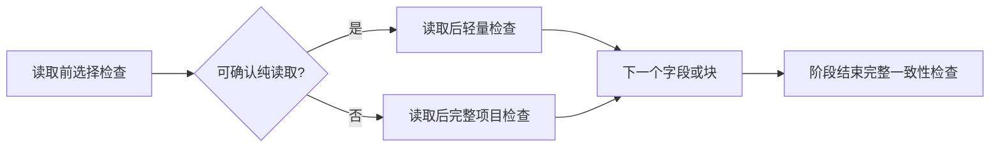

# 投影采集检查修复计划

## Intent

修复自定义 getter 中间状态漏检，保留原生简单字段及普通块的轻量采集收益。

## Data

运行时字段元数据会执行下拉 getOptions(false) 和数字范围 getter；过程采集执行 getProcedureDef/getProcedureCall，声明处理还会查询 getValidator。原实现每个字段和普通块后有全量检查。

## Edges

不修改虚拟画布，不加依赖、不生成新测试用例。默认调用方保留原检查；只在投影优化路径传入可选检查策略。不能用整个画布回退换取局部动态字段兼容性，否则一个下拉框就会恢复原来的平方级全量快照。

只把原生且没有访问器属性的简单字段判为纯读取。数字字段还要求范围 getter 与模块加载时的原生函数一致，且范围存储为数值。子类、静态/动态下拉、变量字段、自定义字段保留全量检查。过程属性存在或使用访问器时保留全量检查。未知机制不猜测其纯度。

## Answer

新增独立检查策略文件，通过原采集函数可选参数传递；调用 getter 之前选择检查，完成后立即执行，防止回调自我替换影响检查选择。执行类型检查和现有回归，审查新增回调边界。

