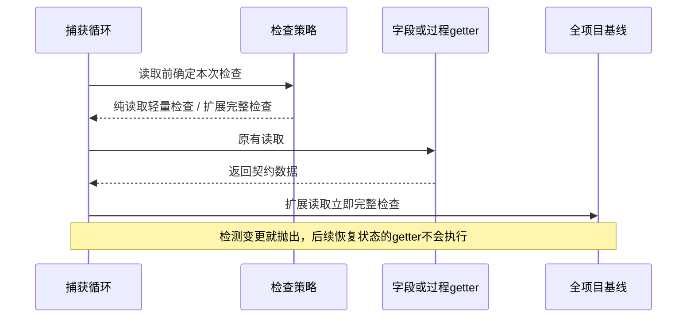

# 投影采集检查修复记录

## Intent：交付结果

修复 review 中的字段/过程 getter 中间状态漏检。完整检查按读取对象选择，不让单个动态字段迫使整个工作区放弃轻量采集。

## Data：实现与验证

新增 `abs-capture-checks.ts` 集中放置检查接口和保守的纯读取判断。修改投影包装器传入策略，三个底层采集文件仅传递可选策略并在对应读取点执行。协调器仍只有此前的一个导入及两处替换。

当前整个优化累计业务范围为两个新增文件、四个既有文件；修复必须把检查传递到字段和过程读取点，不能仅在外层包装结束后检查。未引入临时方法替换、全局共享捕获标志、测试块特判或新依赖。

### 检查选择

| 对象 | 行为 |
| --- | --- |
| 原生文本、勾选、可序列化标签，且无自有访问器 | 轻量上下文/租约检查 |
| 原生数字字段，范围方法未替换且范围存储为数值数据属性 | 轻量检查 |
| 数字方法被覆盖、子类、自有访问器、自定义/未知字段 | 完整项目基线检查 |
| 静态及动态下拉、变量字段 | 完整检查，保守保留扩展行为 |
| 无过程接口的普通块 | 轻量检查 |
| 存在过程接口或对应访问器 | 完整检查；实际调用 getter 后立即检查 |
| 声明处理中的 getValidator 查询 | 返回后立即完整检查 |
| 捕获阶段前后、延迟 fieldDefinition 查询 | 继续完整检查 |

字段与过程检查在调用前选定，避免 getter 自我替换后被误判为纯读取。底层函数未收到新可选参数时，保持原 assertCurrent 行为。

验证结果：

- `tsc --noEmit -p tsconfig.app.json` 通过。
- 现有协调器和运行时契约回归 171 项通过，执行约 21.6 秒。
- `git diff --check` 通过。
- 独立只读复查未发现新增确定性问题，并核对了当前 Blockly fork 数字 getter 只读取 min_/max_/precision_ 的实现。

## Edges：限制与自我审查

- 本次没有新增测试用例，也没有操作用户 UI；中间状态问题的修复依据是立即检查的控制流及独立复查，不冒充已经新增并运行专门的反例用例。
- 动态下拉、变量、自定义字段大量存在时，仍会产生较多全量快照；不能宣称任意工程都已线性化。
- 同一个 getter 内修改后立即恢复、getter 在抛错前造成副作用等旧有边界没有变成任意第三方代码的隔离保证。
- 未重新压测 8209 块，未量化本次保守检查的性能代价，也未验证远端 409。
- 虚拟画布代码保持撤销状态。

## Answer：合并与后续

修复已完成，主要策略集中在新文件，原有函数的默认调用方式兼容。审查结果中关于跨 getter 中间状态的待修复问题由本补丁处理；原审查文档保留作为历史证据。后续如优化大量动态字段，需先明确可靠的状态变更记录，不能再统一删除完整检查。
