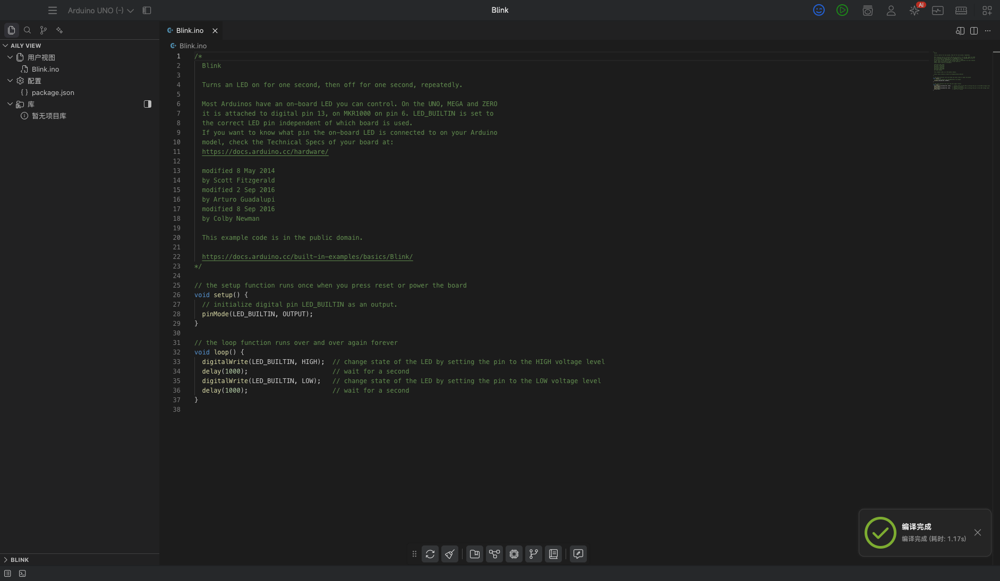
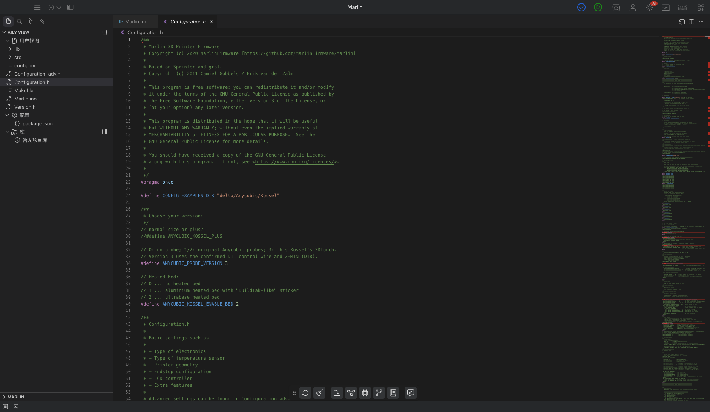

# Coder 原生 Arduino 工程兼容

日期：2026-09-30。

## 使用方式

1. 在 Coder 打开包含 `.ino` 的工程目录，或使用系统“打开方式 → Aily Coder”打开 `.ino`。
2. 首次打开会在原目录创建 Coder `package.json`，保存入口与后续开发板设置。原 `.ino`、头文件及 `src/` 保留原位；已有 manifest 不会被静默覆盖。
3. 从顶部选择实际开发板及 CPU 等参数，然后使用现有编译、端口选择和上传流程。没有开发板时，编译会提示先选板。
4. 多个 `.ino` 标签页按 Arduino 规则合并；编译根目录 C/C++/汇编文件以及 `src/` 中的递归源文件，排除 `data/`、`examples/`、构建缓存等目录。
5. 原生工程可使用 Arduino sketchbook 的 `Documents/Arduino/libraries`、工程及同级 `libraries`，以及现有 Coder 管理的库。Marlin 本次验证使用 Mega 2560 / `cpu=atmega2560`，并提供官方 LiquidCrystal 库。

缓存和生成配置位于 `sketch/`、`.build/` 等目录。工程名固件如 `Blink.hex`、`Marlin.hex` 可被 Coder 产物解析和上传流程识别。选板后仍保留原生入口。

## 实现范围

- `aily--blockly`：原生工程识别、首次配置、模式守卫、`.ino` 启动参数和 macOS open-file 处理、各平台 Coder 文件关联配置、编译入口及源文件哈希、库搜索和固件解析。
- `aily-coder`：默认打开原生入口，用户文件树直接呈现根目录，源码监听与库使用检测覆盖原生源文件。
- `aily-builder`：多标签页合并、根目录和递归源文件编译，复杂条件包含通过目标编译器预处理解析，支持 `.cc` / `.cxx`。

Arduino 布局和合并顺序依据 [Sketch specification](https://docs.arduino.cc/arduino-cli/sketch-specification/) 与 [Sketch build process](https://docs.arduino.cc/arduino-cli/sketch-build-process/)。

## 验证结果

| 验证 | 结果 |
| --- | --- |
| 原始 Blink.ino 的测试副本 | 真实 Electron Coder 中打开、选 Arduino UNO、编译成功；最后一轮 1.17 秒，产物 `.build/Blink.hex` |
| 原始 Marlin 工程的测试副本 | 使用 `.ino` 启动参数直接打开 Coder；实际打开并呈现 `Configuration.h`、`src` 等原始文件 |
| Marlin 真实工具链编译 | Mega 2560 + LiquidCrystal，生成 `.build/Marlin.hex`；程序 195820 字节，RAM 5414 字节，总耗时 173.865 秒 |
| 多标签页测试工程 | 主 `.ino` 调用后续标签页函数，链接根目录 `.cpp/.cc/.cxx` 及 `src` 中 `.c`；排除目录中放置 `#error` 文件仍正常编译 |
| 上传参数 | 真实参数解析函数识别带空格目录、工程名 HEX 和串口参数；未连接设备执行烧录 |
| 构建缓存 | 最后一轮真实 Blink 编译后 `codeHash === buildInfo.lastBuildCode`，日志和历史快照不使固件过期 |
| 回归 | 宿主 Node 44 项、构建元数据 20 项、模式/选板 33 项、编辑器库 21 项、builder 5 项全部通过；宿主/编辑器 TypeScript 检查及 builder 构建通过 |

验证操作使用 `/tmp/aily-arduino-validation/` 副本。Blink.ino 与原始文件一致；Marlin 2152 个原始文件与验证副本逐一比较一致。原始示例目录未写入 Coder 元数据。

[机器可读结果](coder-arduino-validation/result.json)

## 运行与发布边界

本机开发态主程序和编辑器使用 `pnpm run dev` / Angular 热更新链路；更新后的本地 builder 已安装到 `/Users/downey/Library/aily-project/npm-global`，版本号仍为 1.2.17。

Windows、macOS、Linux 的 Coder 打包配置均注册 `.ino` / `.aci`；系统级文件关联需要安装新构建的 Coder，本次未生成或安装发行包。未进行 Windows/Linux 实机验收，未执行真实硬件烧录。发布时需要一并携带宿主、编辑器和 builder 的修改。
