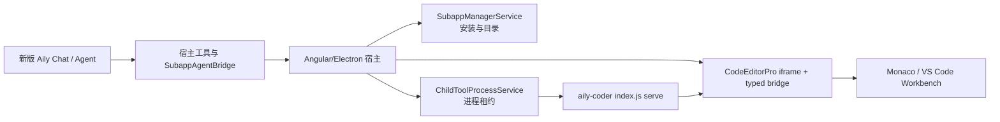

# `downeyin-coder` → 当前子应用架构迁移方案

状态：P1-P3 已在当前分支实施；P4 未触发
日期：2026-08-07
实施宿主分支：`downeyin-subapp-coder`
原分析目标分支：`downeyin-subapp-aily`（分析时 `7c7d9457`）
来源分支：`origin/downeyin-coder`（分析时 `f9f49804`）
共同基线：`d15560d33fa9cc935c4858c63c8afb2156686af8`

## 1. 结论

`downeyin-coder` 的产品目标需要迁移，但不应直接 merge 或 cherry-pick。来源分支在共同基线后有 3 个提交、39 个文件，主要包含：

1. Coder 依赖安装、模式入口门禁和安装反馈；
2. `app.extension` 类型子应用的目录展示和运行状态；
3. Coder iframe 加载动画与显式 workbench ready 协议；
4. 移除 Electron 中 Coder 专用静态/Vite 服务，改走统一子应用 Runtime。

当前分支在来源分支分叉后已经重做了用户级 npm 子应用发现、进程租约、UI surface、Manifest-driven Agent、Aily Chat 子应用调用和运行状态管理。直接合并会覆盖这些新能力，并重新引入旧类型和旧 UI 结构。

建议按“统一安装与运行 → 模式门禁 → ready 状态机 → 可选 Agent 能力”四步迁移。远程代码作为行为参考，不作为文件级合并来源。

## 2. 已确认事实

### 2.1 来源分支内容

| 提交 | 功能 | 迁移判断 |
| --- | --- | --- |
| `eab9c305` | Coder 改为可下载子应用依赖；新增 `CoderDependencyService`；模式欢迎页和 Settings 安装门禁；删除 Coder 专用 Electron 服务 | 迁移行为，按当前服务接口重写 |
| `e50a6c07` | `app.extension` 目录属性；App Store 禁止直接打开/固定 extension；展示进程状态和版本 | 迁移为通用能力，不硬编码 Coder |
| `f9f49804` | 分阶段加载 UI；显式 `aily-coder-ready-protocol` / `aily-coder-ready`；30 秒 ready 超时和旧版本兜底 | 迁移协议和状态机，不整段复制约 1000 行 SCSS |

来源分支相对共同基线约 `+1807/-800`。当前分支与来源分支整体已经相差 355 个文件，说明文件级合并风险明显高于按职责移植。

### 2.2 当前宿主已有能力

- `electron/subapp-manager.js`：用户级 npm 子应用目录、远端/开发目录、包根入口校验、UI surfaces、Agent manifest、runtime 配置。
- `SubappManagerService`：安装、更新、卸载、进度与已安装配置投影。
- `ChildToolProcessService`：统一启动 `node <entry> serve --host 127.0.0.1 --port 0`、租约、复用、重启和运行状态。
- `SubappAgentBridgeService`：Aily Chat 到已安装子应用 Agent manifest 的统一 RPC 桥。
- `MainUiAutomationService`：Aily Chat 打开、控制和排列子应用 UI 的统一入口。
- `CodeEditorProComponent`：现有 workspace、构建产物、板卡、native FS、Diff、剪贴板和宿主 UI 桥。

这些能力应继续作为唯一实现，不新增第二套 Coder 专用安装器、进程服务或 Aily Chat 通道。

### 2.3 当前缺口

| 缺口 | 当前表现 | 后果 |
| --- | --- | --- |
| Coder 仍由 Electron 专用入口启动 | `electron/main.js` 仍有 `coderEmbed` 静态/Vite server，preload 仍暴露 `coderEmbed.getBaseUrl()` | 绕开用户级 npm 子应用生命周期 |
| Coder 尚未进入远端目录 | 2026-08-07 实时读取 `https://rs1.aily.pro/subapp-index.json` 仅有 `aily-chat`、`serial-debugger`、`model-store` | 新用户不能在线安装 Coder；本地开发必须注入 dev 目录 |
| 当前宿主没有完整的 Coder 安装门禁 | Settings/首次选择 Coder 仍主要依据功能配置，不依据可运行包状态 | 未安装时可能进入不可用编辑器 |
| 当前 Coder 没有显式 workbench ready 消息 | `src/loader.ts` / `src/main.workbench.ts` 未发送来源分支定义的 ready 协议 | iframe `load` 可能早于 Monaco/Workbench 可用 |
| extension 元数据在当前 HEAD 未完整贯通 | `AppItem` / `SubappCatalogItem` 未完整声明并消费 `extension` | Coder 可能被当成普通可打开/固定应用 |

## 3. 目标职责边界



### 宿主拥有

- Coder 是否可用、安装/更新/卸载状态和进度；
- 子应用 Runtime 生命周期与进程租约；
- 当前工程、构建、烧录、板卡、库、主题、语言和原生文件系统权限；
- Aily Chat 会话、Agent 工具和审批；
- 打开库管理、切换板卡、OS reveal、剪贴板等桌面行为；
- 对 Coder iframe 消息来源、路径范围和协议版本的校验。

### `aily-coder` 拥有

- Monaco/VS Code Workbench 初始化、编辑器布局和本地视图状态；
- Aily View、源码编辑、语言服务客户端；
- 收到宿主上下文后的展示和编辑行为；
- workbench 真正可交互时发送 ready 消息；
- 与编辑器内部状态直接相关的轻量交互。

### Aily Chat 与 Coder 的关系

来源分支中的 `native-fs`、host-context、打开库管理、切板、剪贴板、Diff 等消息，是“宿主 ↔ 编辑 surface”协议，不是 Aily Chat Agent 协议。

新版 Aily Chat 应继续调用宿主已有的 project/editor/builder/child-app 能力。只有当 Coder 将来出现宿主没有的独立业务能力时，才在 `aily-coder` 声明 `ailySubapp.agent`、`agent/tools.json` 和标准 RPC；不要为了迁移而把已有宿主工具复制成一套 Coder Agent。

## 4. 建议实现结构

### 4.1 安装与可用性

不建议原样复制 150 行、固定 `aily-coder` 的 `CoderDependencyService`。建议新增一个按 catalog id 工作的通用 required-subapp 服务：

```ts
observe(id: string): Observable<RequiredSubappState>
ensureInstalled(id: string): Promise<{ installedNow: boolean }>
```

它只组合 `SubappManagerService.state$`、`progress$` 和并发安装 Promise，不拥有第二份目录状态。Coder 页面只保留常量：

```ts
export const AILY_CODER_SUBAPP_ID = 'aily-coder';
```

如果后续 Simulator、模型服务或其它模式也需要依赖门禁，可复用同一服务。

### 4.2 Runtime 获取

`CodeEditorProComponent` 的启动链统一为：

1. 解析并登记工程；
2. `ensureInstalled(AILY_CODER_SUBAPP_ID)`；
3. `ChildToolProcessService.acquire(AILY_CODER_SUBAPP_ID)`；
4. 使用返回的 `ready.url` 构造 iframe URL；
5. 销毁时 `release(AILY_CODER_SUBAPP_ID)`。

删除并禁止回退到：

- `electronAPI.coderEmbed.getBaseUrl()`；
- Electron 内的 `child/coder` Vite 启动；
- 生产静态 `child/coder/dist` 服务；
- 浏览器环境外的硬编码 `127.0.0.1:5174` 生产回退。

浏览器独立开发仍可使用 `npm start`，但 Electron 集成只走统一 Runtime。

### 4.3 Ready 协议

保留来源分支的核心语义，收敛为一个小型版本化契约：

```ts
type AilyCoderReadyMessage =
  | { channel: 'aily-coder-ready-protocol'; version: 1 }
  | { channel: 'aily-coder-ready'; version: 1 };
```

- `loader.ts` 尽早发送 protocol 消息，表示当前 Coder 支持显式 ready；
- `main.workbench.ts` 在 Workbench 初始化完成并经过两帧布局后发送 ready；
- 宿主必须验证 `event.source === iframe.contentWindow`；
- 支持 protocol 的版本使用 30 秒超时，超时展示可重试错误；
- 仅对旧版 Coder 保留短暂 iframe-load 兜底，后续版本可删除；
- 主题变化只更新上下文，不重复 acquire Runtime。

加载遮罩建议拆成小型 presentational component，输入只有 `stage`、`visible`、`revealing`、`error`，避免继续扩大 `CodeEditorProComponent` 和整段复制来源分支 SCSS。

### 4.4 `app.extension`

按元数据通用实现：

- `AppItem`、`ChildToolAppConfig`、`SubappCatalogItem` 增加 `extension?: boolean`；
- `electron/subapp-manager.js` 同时读取目录 `app.extension` 和安装包 `ailySubapp.app.extension`；
- extension 不允许普通 open/pin/toolbar normalization；
- App Store 使用 `ChildToolProcessService.runtimeStates$` 显示灰/绿运行点、版本、端口和 PID；
- 不写 `if (id === 'aily-coder')` 的 UI 分支。

### 4.5 模式入口

首次模式选择和 Settings 共用同一 required-subapp 状态：

- Blockly：立即可进入，不等待 Coder；
- Coder 已安装：立即进入；
- Coder 未安装：点击后安装，按钮显示真实进度，成功后进入；
- 安装失败：保持在当前页面，展示可重试错误；
- “安装成功”提示只在本次操作确实安装了新包时显示；
- 两个入口不得各自维护一套安装布尔值。

## 5. 来源文件迁移矩阵

| 来源文件/区域 | 当前目标 | 处理方式 |
| --- | --- | --- |
| `electron/main.js` Coder 专用 server 删除 | 当前 `electron/main.js` | 在统一 Runtime 接入完成后删除专用 IPC、server、退出清理 |
| `electron/preload.js` / `electron.d.ts` coderEmbed | 当前 preload/type | 删除 Coder 专用 API |
| `coder-dependency.service.ts` | 新通用 required-subapp service | 重写，不直接复制 |
| `mode-welcome/*` | 当前 mode-welcome | 只迁移状态和交互，保留当前 DOM/CSS 结构 |
| `settings/*` | 当前 Settings | 与 mode-welcome 共享服务 |
| `electron/subapp-manager.js` builtin Coder/extension | 当前目录验证和远端目录 | 迁移 extension 解析；正式 Coder 条目最终放远端目录，不长期硬编码 builtin 版本 |
| `tool.config.ts` / `subapp-manager.service.ts` | 当前 DTO | 增加通用 `extension` 投影 |
| `app-store/*` | 当前 App Store | 迁移通用 extension 行为与 runtime dot |
| `code-editor-pro.component.ts` ready/Runtime | 当前 CodeEditorPro | 按当前 `ChildToolProcessService` 重写 |
| `code-editor-pro.component.html/scss` loader | 独立 loading component | 迁移视觉意图，压缩状态和样式 |
| `public/i18n/*` | 当前三套主 UI 语言 | 仅加入真实可见文案；Coder 目录标题放子应用 `i18n/` |
| `aily-coder/src/loader.ts` / `main.workbench.ts` | Coder 仓库 | 增加 version 1 ready 消息 |

## 6. 实施顺序

### P0：开发链路（本轮已完成）

`/Users/downey/Projects/ZCK/aily-coder` 已调整为当前子应用契约：

- 生产 UI 从 `dist/index.html` 改为包根 `ui/index.html`；
- 补齐 `ailySubapp.id/package/namespace/titleKey/app.extension`；
- 补齐 `i18n/en.json`、`zh_cn.json`、`zh_hk.json`；
- `npm run dev:link` 构建、备份原安装包、注册 `file:` 依赖、合入 Coder dev 目录并软链源码；
- `npm run dev` 在上述基础上监听 Vite build，向已加载 iframe 发送 reload；
- `npm run dev:unlink` 恢复安装包、依赖和目录；
- 所有开发目录写入均保留其它子应用条目，并在最后一个开发软链结束后恢复原目录。

开发命令：

```bash
cd /Users/downey/Projects/ZCK/aily-coder
npm run dev

# 一次性链接，不启动 watcher
npm run dev:link

# 结束联调
npm run dev:unlink
```

### P1：统一安装与 Runtime

1. 增加通用 required-subapp 状态服务和测试；
2. 贯通 `app.extension` DTO、目录解析和 App Store 行为；
3. `CodeEditorPro` 改用 `SubappManagerService` + `ChildToolProcessService`；
4. 删除 Coder 专用 Electron server/preload；
5. 为当前开发目录增加 Coder 集成 fixture，证明包根 `ui/index.html` 可发现。

### P2：入口门禁

1. mode-welcome 接入统一状态；
2. Settings 接入同一状态；
3. 三套主 UI 语言补齐安装、失败、重试和提示；
4. 验证 Blockly 不受 Coder 安装影响。

### P3：显式 Ready 与加载 UI

1. Coder 发送 version 1 protocol/ready；
2. 宿主验证 iframe source 并实现 ready timeout；
3. 抽取 loading component；
4. 验证 dark/light、窄/宽布局、reduced motion；
5. 验证旧 Coder 的受控 fallback，记录删除版本。

### P4：可选 Aily Chat 能力

仅在出现明确、不能由宿主已有工具完成的 Coder 独立能力时实施：

1. 在 `aily-coder` 增加 `ailySubapp.agent`；
2. 增加 `agent/tools.json` 和标准 `aily-child-rpc`；
3. 使用现有 `SubappAgentBridgeService` 自动投影给新版 Aily Chat；
4. 不新增 Aily Chat ↔ Coder 私有 RPC。

## 7. 验收标准

### 开发链路

- `npm run build:subapp` 通过；
- `node --test scripts/link-dev.test.mjs` 通过；
- 隔离目录 link 后存在包软链、`file:` 依赖、`dev: true` 和 `aily-coder` 目录项；
- unlink 后原索引、原依赖、原安装包完整恢复；
- `npm pack --dry-run` 包含 `index.js`、`ui/index.html`、UI assets 和三套 i18n；
- `node index.js serve --host 127.0.0.1 --port 0` 输出 ready，首页和静态资源 HTTP 200；
- watch 模式产生 reload 事件，iframe HTML 注入本地 reload client。

### 宿主迁移

- `node --test electron/subapp-manager.test.js` 通过；
- `npx tsc -p tsconfig.app.json --noEmit` 通过；
- 未安装 Coder 时两个入口显示一致状态并能安装；
- Blockly 入口永不等待 Coder；
- Coder Runtime 只启动一份，页面销毁后按租约释放；
- 生产路径不访问 `child/coder`、5174 或 `coderEmbed` IPC；
- iframe load 不会提前隐藏 loading；显式 ready 后才可交互；
- 主题切换不重启 Runtime，不丢失工作区；
- Aily Chat 原有 project/editor/subapp Agent 工具不回归。

### 真实环境

- 在 Electron 中验证首次安装、已安装、安装失败重试、更新后需重启四种状态；
- 验证 dark/light、窄/宽窗口和 Windows 路径；
- 明确区分“构建通过”“本机 Electron 通过”“新用户在线安装通过”。

## 8. 发布阻塞与风险

1. `@aily-project/subapp-aily-coder` 必须先发布可安装版本，并把 `aily-coder` 加入远端 `subapp-index.json`；当前远端目录缺少该条目，因此不能宣称新用户在线安装已经可用。
2. 远端目录版本必须与 npm 实际版本一致；不要在宿主长期硬编码 `0.1.0` 兜底，否则更新状态会失真。
3. Coder Workbench 包较大，安装进度必须来自真实下载/解压事件，不能用固定动画伪造完成。
4. iframe ready、LSP WebSocket 和 Coder Runtime ready 是三个不同状态；LSP 失败不应误判 Workbench 未就绪，反之亦然。
5. native FS 桥继续限制在 workspace、构建缓存和批准的平台包路径内；迁移 Runtime 不得放宽路径边界。

## 9. 实施结果与当前边界

本轮已在宿主实现 P1-P3：通用 required-subapp 门禁、`app.extension` 元数据与 App Store 行为、统一 Runtime 租约、模式入口安装流程、显式 ready 协议及独立加载组件；同时删除了 Coder 专用 Electron server/preload API。`aily-coder` 已补充 version 1 ready 消息和不重启 Runtime 的主题同步。

已完成的自动验证包括：

- 宿主 TypeScript 检查与 Angular development 构建；
- required-subapp 4 项浏览器单测；
- Electron subapp manager 26 项测试（含 Coder 包根 fixture）；
- Coder lint、typecheck、生产构建、2 项 dev-link 测试与 `npm pack --dry-run`；
- `node index.js serve --host 127.0.0.1 --port 0` 的首页与静态资源 HTTP 200 冒烟。

P4 未实施：目前没有明确且不能由宿主已有工具完成的 Coder 独立 Agent 能力。远端目录发布、新用户在线安装、真实 Electron 四种安装/更新状态、Windows 路径与实体设备链路仍属于发布或跨平台验收边界，不能由本轮自动验证替代。
