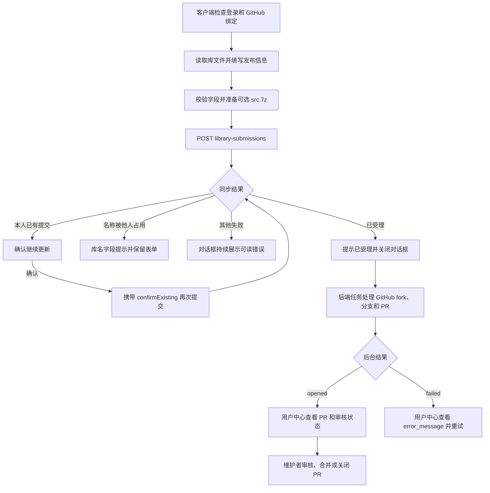

# 库发布流程与错误展示约定

本文对照 `aily-blockly` 与相邻仓库 `aily-services` 的实际代码，说明客户端“发布库”从本地文件准备到 GitHub PR 的过程。当前接口提交的是库 PR；接口受理、PR 创建、审核合并是不同阶段。本次调整统一客户端发布流程的错误展示，不修改后端接口、数据库或服务部署。

## 1. 流程和职责



客户端入口是工具箱的库发布菜单，由 `blockly-toolbox-pane.component.ts` 协调，表单由 `LibraryPublishDialogComponent` 展示，文件读取与上传分别使用 `BlocklyLibraryPackageService`、`LibrarySubmissionService`。

1. 检查 Aily 登录和 GitHub 绑定；绑定操作完成后继续原发布流程。权限检查请求失败时显示真实错误，不将网络或服务异常当成“未绑定”。表单校验库名、版本、显示名称和真实硬件测试确认。
2. 从本地库读取 `package.json`、`block.json`、`toolbox.json`、`generator.js`、`readme.md`、`readme_ai.md`、可选 `i18n/`、`pinmaps/`。把表单中的元数据修改合并到本次请求的 `packageJson`。
3. 优先复用已有非空 `src.7z`；没有可用压缩包但存在非空 `src/` 时，在临时目录打包。仅清理本次创建的临时压缩包，不删除已有库文件。打包失败在发请求之前终止。
4. 没有源码压缩包时提交 JSON；存在压缩包时提交 multipart，`payload` 是 JSON 字符串，`src_archive` 的文件名固定为 `src.7z`。
5. Kong 校验登录 JWT，再将请求转给 workspace 服务。后端校验 payload、源码压缩包和 GitHub 绑定，检查重复提交或名称占用，然后持久化 submission。
6. 后端认领 `pending` 记录，将其置为 `processing`，使用 FastAPI `BackgroundTasks` 处理 GitHub 请求。POST 通常在 PR 创建前返回；客户端显示“提交已受理”，关闭对话框。
7. 若勾选同步元数据，在受理之后保存本地 `package.json`。保存失败单独提示“已受理，但本地保存失败”，远端提交仍成功，不能把它作为发布失败再次发送。
8. 当前桌面客户端不轮询 submission。成功提示提供用户中心入口 `/user/library-submissions`，后续失败、重试和 PR 状态在外部用户中心查看。

## 2. 后端 PR 处理

workspace 的入口为 `services/workspace/src/library_submission/router.py`，主逻辑为同目录的 `service.py`。

- 使用当前用户绑定的 GitHub token 获取 GitHub 用户名和权限。实际代码要求 `repo` scope。
- 获取线上 `libraries.json` 和 `package-folder-map.json`，判断目标库目录和已发布版本。存在目录映射时为 `update`，否则为 `create`；索引已有同名包但缺少目录映射时失败，不能另建同名目录。
- 新库采用提交版本。已发布库的提交版本大于线上版本时保留；小于或等于线上版本时使用线上 patch + 1。该最终版本写入 PR 文件，响应不返回最终版本，也不会因此自动同步客户端本地版本。
- fork `ailyProject/aily-blockly-libraries` 到用户账号；检查 fork 来源与写权限，等待基础分支可用。
- 基于共同祖先提交构造库文件 commit，再创建或更新 `aily-submit/...` 分支；限定写入目标库目录。更新模式会替换该库的 `i18n/`、`pinmaps/` 文件集合。
- 校验分支仍指向本次 commit，向上游 `main` 创建 PR；已有同分支 open PR 时更新该 PR。成功记录 `pr_number`、`pr_url`，状态变为 `opened`。
- 后台异常将记录置为 `failed`，保存 `error_message`。异步异常不会修改此前已经返回的 POST 成功响应。

PR 后续由维护者审核。GitHub webhook 与后台补偿任务同步 `opened`、`closed`、`merged` 状态。首次新库合并的积分奖励使用独立事件 `library.pr_merged_first_publish`，不参与 PR 创建事务；积分异常不代表提交失败。这里不把 PR 已创建或已合并等同于 npm/CDN 已分发，后续分发不由该提交接口完成。

## 3. 请求与响应契约

接口前缀均为 `/api/v1/library-submissions`。

| 请求 | 用途 |
| --- | --- |
| `POST /` | 提交新库或确认更新已有提交 |
| `GET /me` | 当前用户提交列表，支持 `status`、`package_name`、`page`、`per_page` |
| `GET /me/{id}` | 当前用户单条提交，并在符合条件时同步 PR 状态 |
| `POST /me/{id}/retry` | 使用服务器保存的原始 payload 重试失败记录 |
| `DELETE /me/{id}` | 软删除提交记录；`pending`、`processing` 不可删除 |

JSON 请求结构如下，multipart 中 `payload` 使用相同内容：

```json
{
  "package": {
    "packageJson": { "name": "@aily-project/lib-demo-sensor", "version": "1.0.0" },
    "blockJson": [],
    "toolboxJson": {},
    "generatorJs": "// generator code",
    "readme": "库使用说明",
    "readmeAi": "AI 使用说明",
    "i18n": {},
    "pinmaps": {}
  },
  "prDescription": "本次提交说明",
  "confirmExisting": false
}
```

后端要求库名匹配 `@aily-project/lib-{小写字母、数字、连字符组成的 slug}`，slug 至少两字符，首尾为字母或数字。版本为 `x.y.z`，`private` 不能为 `true`，两个 readme 和 generator 不能为空。`prDescription` 最长 2000 字符。可选 `src.7z` 必须非空、最大 50 MiB，并通过后端的 7z 文件头检查。

成功返回 HTTP 200 和 `ResponseBaseModel`：

```json
{
  "status": 200,
  "data": {
    "id": 123,
    "mode": "pending",
    "package_name": "@aily-project/lib-demo-sensor",
    "package_slug": "demo-sensor",
    "target_dir": "demo-sensor",
    "branch": "aily-submit/demo-sensor-user-123",
    "pr_url": null,
    "pr_number": null,
    "status": "processing",
    "error_message": null
  },
  "messages": null,
  "errorCode": null,
  "errorArgs": {},
  "errorMessage": null
}
```

客户端必须检查业务 `status === 200` 且存在 submission `data`，不能只因为 HTTP 请求成功就提示已受理。列表的 `data` 为 `{total,page,per_page,items}`。

后端目前存在多种错误载体，前端需兼容，不能宣称服务端异常格式已全局统一：

| 来源 | 响应形状 |
| --- | --- |
| 发布业务 HTTPException | HTTP 4xx/5xx，`{detail:{errorCode,message,errorArgs?}}` |
| Kong 登录认证 | HTTP 401，`{status:401,data:null,messages,errorMessage,errorCode,errorArgs:{}}` |
| workspace 身份依赖 | HTTP 401，`{detail:"Not authenticated"}` 等字符串 |
| FastAPI 参数校验 | HTTP 422，`{detail:[{loc,type,msg,...}]}`；提交 payload 自身的模型校验已由路由转成 400 |
| 已受理后的任务失败 | 查询 HTTP 200，`data.status === "failed"`，原因在 `data.error_message` |
| 本地读文件、打包或网络异常 | JavaScript `Error`、字符串、HTTP 错误对象等，无固定业务 envelope |

## 4. 重复提交和状态

同一用户已有同包名记录时，首次请求返回 HTTP 409：

```json
{
  "detail": {
    "errorCode": "library_submission_already_submitted",
    "message": "You have already submitted this package. Confirm to update the existing submission.",
    "submitted_by_current_user": true,
    "conflict_type": "current_user_submission",
    "same_content": false,
    "submission": { "id": 123, "status": "opened", "pr_number": 456 }
  }
}
```

上例的 `submission` 为简写，实际响应为完整记录。确认后必须重新提交完整 package 并携带 `confirmExisting: true`：

- 已有 open PR 且内容及 PR 描述一致：返回原记录，不重复创建 PR。
- 已有 `pending` 或 `opened` 记录且内容有变化：复用原记录和分支，重新处理。
- 原记录正在 `processing`：直接返回原记录，本次新内容不会覆盖正在处理的任务。
- 原记录为 `failed`、`closed`、`merged`：确认再次提交会新建记录；失败记录的 `/retry` 接口则复用原记录和保存的 payload。
- 他人已有同包名记录：返回 `library_submission_package_name_occupied`、`submitted_by_current_user: false`、`conflict_type: "package_name_occupied"`。

冲突判断使用明确 `errorCode` 和归一化 metadata。不能通过“package name”“already exists”“同名”等宽泛文本推断库名被占用，否则 GitHub fork 同名、目录映射异常或包名校验错误都会被误导成改库名。

| 状态 | 含义 | 用户操作 |
| --- | --- | --- |
| `pending` | 已记录，等待后台处理 | 在用户中心刷新状态 |
| `processing` | 正在处理 fork、分支、commit 或 PR | 等待，避免重复提交 |
| `opened` | PR 已创建，尚未关闭 | 打开 PR，等待审核 |
| `failed` | 后台处理失败 | 查看 `error_message`，修正授权/内容后重试 |
| `closed` | PR 关闭且未合并 | 查看关闭原因，必要时重新提交 |
| `merged` | PR 已合并 | 查看合并结果 |

## 5. 客户端统一错误展示

`api-error.utils.ts` 负责从可预期错误字段提取纯文本，`LibrarySubmissionService` 补充 HTTP 状态与冲突 metadata，`library-submission-error.utils.ts` 生成最终发布错误说明。归一化结构保留既有 `ApiErrorDetails`，扩展为发布流程使用的 `LibrarySubmissionApiError`：

```ts
{
  errorCode: 'library_submission_package_name_occupied',
  errorArgs: {},
  message: 'This package name is already occupied by another user.',
  status: 409,
  raw: originalError,
  submittedByCurrentUser: false,
  conflictType: 'package_name_occupied',
  sameContent: undefined,
  submission: undefined,
}
```

`raw` 仅供程序保留上下文，不直接展示或序列化到 UI。任何通用对象都不能用 `String(error)`、模板字符串插值或直接传给 toast 生成错误内容。

展示规则：

1. 保留后端或本地异常的可读原因；支持 `errorMessage`、`error_message`、`messages`、`message`、`detail`、`msg` 等字段，以及 `Error.message` 和字符串。缺失原因时使用本地化兜底文案；Angular 通用传输错误和代理 HTML 页面使用网络或服务异常提示。
2. 校验错误数组逐项提取文本；带 `loc` 的 `msg` 保留字段路径。对象没有可读错误字段、空字符串或含 `[object Object]` 时使用有意义的默认失败原因。
3. 发布失败在对话框内持续显示，统一为“发布失败：原因”。诊断信息优先展示业务码，没有业务码时展示 HTTP 状态；存在 GitHub Request ID 时附加该 ID。网络无响应的状态 `0` 使用网络提示，不显示为真实 HTTP 状态码。
4. 对话框保留填写内容，结束 loading。用户下一次提交时更新错误区域，避免同一失败堆叠多个 toast。库名占用保留库名字段提示，用户改名后清除旧冲突。
5. 本人重复提交弹确认框；取消更新或取消授权是用户取消，不显示发布失败。
6. 已受理后的本地元数据保存异常单独显示警告。不能回滚客户端的远端成功结果，也不能触发重新提交。
7. 加载本地库失败导致表单无法打开时，可显示一次纯文本错误并关闭；外层入口只处理没有被对话框处理的失败。

例如，后端 `{detail:{errorCode:"github_fork_ref_not_ready",message:"...",errorArgs:{githubRequestId:"REQ123"}}}` 应显示后端的 GitHub 基础分支未就绪说明，并附业务码和 `REQ123`；普通对象 `{unexpected:true}` 应显示默认失败原因。

## 6. 主要业务错误

下表 HTTP 状态指异常被同步返回时的状态；若异常发生在后台，客户端查询仍收到 HTTP 200 和 `failed/error_message`。

| HTTP | errorCode | 展示与处理 |
| --- | --- | --- |
| 400 | `library_submission_invalid` | 展示具体缺失字段、格式或源码压缩包错误，保留表单 |
| 400 | `github_not_bound` | 引导绑定 GitHub |
| 401 | `github_token_invalid` | 重新授权 GitHub |
| 403 | `github_repo_scope_required` | 重新授权并授予 `repo` 权限 |
| 403 | `github_permission_denied`、`github_fork_permission_denied` | 展示权限问题，按授权流程处理 |
| 403 | `github_fork_ref_not_ready` | fork 的基础分支未就绪，稍后重试 |
| 403 | `github_fork_branch_write_failed` | fork 分支写入失败，展示后端原因和可用 Request ID |
| 409 | `library_submission_already_submitted` | 本人已有提交，确认是否继续 |
| 409 | `library_submission_package_name_occupied` | 他人占用，库名字段提示修改 |
| 409 | `github_fork_unavailable` | GitHub 同名仓库不属于预期 fork，不应提示修改库名 |
| 409 | `library_target_dir_not_found` | 已发布包缺少目录映射，不应提示修改库名 |
| 409 | `github_submission_branch_changed` | PR 创建前分支发生变化，提示重试 |
| 404 | `library_submission_not_found` | 记录不存在或不可访问 |
| 409 | `library_submission_not_failed`、`library_submission_retry_unavailable` | 当前记录不允许重试或没有保存原始 payload |
| 409 | `library_submission_delete_unavailable` | 正在处理，暂不能删除记录 |
| 502 | `libraries_index_unavailable`、`package_folder_map_unavailable` | 发布索引/目录映射服务不可用，稍后重试 |
| 502 | `github_user_missing`、`github_api_error` | 展示 GitHub 返回的可读原因 |
| 500 | `library_submission_path_scope_violation` | 文件超出目标目录，停止提交并保留诊断信息 |

Kong 的登录错误码 `AUTH_TOKEN_MISSING`、`AUTH_TOKEN_INVALID`、`AUTH_TOKEN_EXPIRED` 属于 Aily 登录状态，不应与 GitHub token 失效混淆。后端源码还存在未调用的 `_published_package_exists_payload()`；不能据此认为当前发布路径必然返回 `library_submission_package_name_exists`。

## 7. 当前限制与代码位置

- 后台失败只持久化 `error_message`，没有保存对应业务码和 `errorArgs`；GitHub 原始异常还可能只保存上游原始消息。用户中心不能假设异步失败自带可供自动授权/重试判断的结构化错误码。
- 旧后端文档声明 `public_repo` / `user:email` 即可，但实际 `_validate_github_token_scopes()` 要求 `repo`，以代码为准。
- 单条查询在没有取到 token 时可以返回已有记录；若取到的 token 已失效，或同步 GitHub PR 遇到非 404 错误，当前实现仍会抛出 401/403/502。不要把文档中的“token 不可用也不影响查询”理解为所有情况都已兜底。
- 提交任务使用进程内 `BackgroundTasks`。本次未改造后台任务可靠性，也未添加客户端轮询、后端错误码持久化或全服务统一异常处理。

主要代码位置：

| 仓库 | 文件 | 职责 |
| --- | --- | --- |
| aily-blockly | `src/app/components/library-publish-dialog/library-publish-dialog.component.ts` | 表单校验、提交中状态、失败展示 |
| aily-blockly | `src/app/editors/blockly-editor/components/blockly/components/blockly-toolbox-pane/blockly-toolbox-pane.component.ts` | 登录/绑定、重复确认、名称冲突、本地保存与用户中心入口 |
| aily-blockly | `src/app/services/domains/dependencies/blockly-library-package.service.ts` | 本地库文件读取和校验 |
| aily-blockly | `src/app/services/domains/dependencies/library-submission.service.ts` | 打包、JSON/multipart 上传、响应校验和错误 metadata |
| aily-blockly | `src/app/utils/api-error.utils.ts` | 从多种错误载体提取可读文本 |
| aily-blockly | `src/app/utils/library-submission-error.utils.ts` | 生成发布错误说明、兜底文案和诊断信息 |
| aily-services | `gateway/kong.yml` | 认证 envelope 和 workspace 路由 |
| aily-services | `services/workspace/src/library_submission/router.py` | HTTP 请求处理和后台任务调度 |
| aily-services | `services/workspace/src/library_submission/service.py` | 重复提交、版本、GitHub PR 和失败记录 |
| aily-services | `services/workspace/src/library_submission/validation.py` | payload、源码压缩包和文件名校验 |
| aily-services | `services/workspace/src/library_submission/github_client.py` | GitHub API 及上游 Request ID |
| aily-services | `services/workspace/src/library_submission/reward.py`、`reward_router.py` | PR 状态同步与合并奖励 |
| aily-services | `services/workspace/src/schemas.py` | 公共成功/业务 envelope 定义 |

## 8. 模拟故障验证

2026-09-08 在 ChromeHeadless 中运行发布相关测试，结果 **56 / 56 通过**。其中 17 项使用真实 Angular 发布表单、HttpClient 和 LibrarySubmissionService，将模拟响应一直传到弹窗 DOM；文件读取、HTTP 后端、GitHub 授权事件和健康检查使用测试替身，没有向服务端提交真实发布。

| 模拟情况 | 验证结果 |
| --- | --- |
| HTTP 400/401/403/409/422/429，Kong envelope、FastAPI detail 字符串/对象/校验数组 | 提取原因、字段路径及可用错误码/Request ID，弹窗只保留一个错误区域 |
| HTTP 500 空正文、502 HTML、未知对象、旧服务返回 `[object Object]` | 使用可读兜底，不展示通用对象或代理页面 |
| HTTP 200 但业务失败、缺少提交记录 | 不关闭弹窗、不提示成功，保留表单 |
| 断网、请求超时、连续失败后用户再次成功提交 | 清除旧错误、恢复按钮状态，成功后正常关闭 |
| 健康检查恢复、健康检查三次失败、自动重发仍失败 | 最多自动重发一次；健康检查始终失败不重发；400/409 不自动重试 |
| 本人重复提交、他人占名、GitHub fork 冲突 | 分别走确认、库名提示和普通错误；取消确认不重发 |
| 取消 GitHub 授权、授权完成后权限检查失败、授权等待超时和迟到事件 | 不误重发、不误报成功；超时清理订阅并显示明确原因 |
| 本地文件读取/压缩失败、服务受理后本地保存失败 | 前者不发送请求；后者保留受理成功并单独警告 |
| 英文兜底、错误文本包含 HTML 标签 | 使用当前语言；标签按文本渲染，不创建 HTML 元素 |

本轮先复现了 GitHub 授权超时静默返回的问题（定向测试 9 通过、1 失败），将超时改为可读错误后，统一测试全部通过。该测试使用虚拟时间，不实际等待五分钟。

复现命令（仓库根目录）：

```powershell
node ./node_modules/@angular/cli/bin/ng.js test --watch=false --browsers=ChromeHeadless --include=src/app/utils/api-error.utils.spec.ts --include=src/app/utils/library-submission-error.utils.spec.ts --include=src/app/services/domains/dependencies/library-submission.service.spec.ts --include=src/app/components/library-publish-dialog/*.spec.ts --include=src/app/editors/blockly-editor/components/blockly/components/blockly-toolbox-pane/blockly-toolbox-pane.component.spec.ts --include=src/app/interceptors/retry.interceptor.spec.ts
```

这些测试验证客户端错误处理和渲染；后台 PR 任务执行、GitHub 实际可用性和用户中心的异步失败页面不在本轮模拟范围内。构建仍报告中英文语言文件原有的 `TFTESPI_IMAGE` 重复键警告，与发布测试无关。
